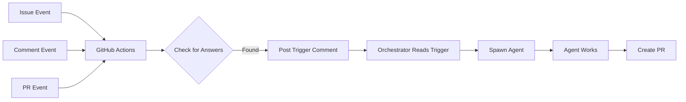

# Multi-Agent Development Orchestrator

> **Event-driven orchestration system for managing development agents via GitHub Actions**

This document describes the multi-agent orchestration system used to build raibid-cli. The orchestrator automatically spawns development agents to work on GitHub issues in parallel, using GitHub Actions and event-driven workflows.

## Overview

The orchestrator is an event-driven system that:
- Monitors GitHub issues for clarifying questions
- Detects when questions are answered
- Spawns Claude Code agents to complete the work
- Creates pull requests automatically
- Scales work across multiple parallel agents

## Quick Start

### For Users (Running the Orchestrator)

The orchestrator runs automatically via GitHub Actions. No manual setup needed.

**To trigger agent work:**

1. Create or update an issue
2. If the agent asks clarifying questions, answer them in a comment using numbered list format:

```markdown
1. Yes, use Helm for deployment
2. Use NodePort for service exposure
3. Enable persistence with 10Gi storage
```

3. The orchestrator detects the answers (30-60 seconds)
4. An agent is spawned automatically
5. The agent creates a PR when complete

### Manual Agent Spawning (Development)

```bash
# Launch orchestrator manually with Nushell
nu scripts/launch-orchestrator.nu

# The orchestrator will:
# 1. Read all open issues
# 2. Detect answered questions
# 3. Spawn agents for ready issues
# 4. Monitor progress
```

## Architecture

### Event-Driven Orchestration

The system uses GitHub Actions workflows triggered by events:



### Key Components

#### 1. GitHub Actions Workflows

Located in `.github/workflows/`:

- **`orchestrator-issue-events.yml`** - Triggers on issue create/edit/label
- **`orchestrator-comment-events.yml`** - Triggers on comments (detects answers)
- **`orchestrator-pr-events.yml`** - Triggers on PR merge (spawns dependent work)

#### 2. Orchestrator Agent

The orchestrator agent (run via `launch-orchestrator.nu`):
- Reads GitHub issues and comments
- Identifies issues with answered questions
- Spawns development agents using Claude Code Task tool
- Monitors agent progress
- Handles errors and retries

#### 3. Development Agents

Development agents:
- Receive issue requirements via Task tool
- Follow TDD workflow (tests first)
- Implement features
- Create pull requests
- Report completion status

## Configuration

### Answer Format Detection

The orchestrator detects multiple answer formats:

✅ **Numbered lists** (recommended):
```
1. Yes, use Helm
2. NodePort
3. 10Gi storage
```

✅ **Prefixed answers**:
```
A1: Yes, use Helm
A2: NodePort
A3: 10Gi storage
```

✅ **Decision labels**:
```
Decision: Approved - Use Helm with NodePort
```

### GitHub Actions Configuration

The workflows use these environment variables:

```yaml
env:
  GITHUB_TOKEN: ${{ secrets.GITHUB_TOKEN }}  # Automatic token
  GH_TOKEN: ${{ secrets.GITHUB_TOKEN }}      # For gh CLI
```

### Orchestrator Configuration

The orchestrator can be configured via:

```bash
# Environment variables
export RAIBID_ORCH_POLL_INTERVAL=60  # Polling interval in seconds
export RAIBID_ORCH_MAX_AGENTS=5      # Max parallel agents

# Or via config file
cat > ~/.config/raibid/orchestrator.yaml <<EOF
polling:
  interval_seconds: 60
  max_parallel_agents: 5
agent:
  model: "sonnet"  # or "haiku" for faster agents
  timeout_minutes: 30
EOF
```

## Usage Examples

### Example 1: Infrastructure Implementation

**Issue #13: k3s Installation**

1. Agent asks clarifying questions:
   ```
   Q1: Which k3s version should we target?
   Q2: Should we support ARM64 only or also AMD64?
   Q3: Where should checksums be verified?
   ```

2. User answers:
   ```markdown
   1. Latest stable (v1.28.5+k3s1)
   2. Support both ARM64 (primary) and AMD64
   3. Verify against official GitHub release checksums
   ```

3. Orchestrator detects answers → spawns agent
4. Agent implements feature → creates PR #25
5. User reviews and merges PR

### Example 2: Parallel Work

**Issues #14 (Gitea) and #15 (Redis)** - Both depend on #13 (k3s)

1. User merges PR #25 (k3s complete)
2. Orchestrator detects merge via PR event
3. Checks issues #14 and #15 - both unblocked
4. Spawns 2 agents in parallel
5. Both agents complete simultaneously → PRs #26 and #27
6. User merges both PRs

## Workflow Details

### Issue Lifecycle

```
┌─────────────┐
│ Issue Opens │
└──────┬──────┘
       │
       ▼
┌─────────────────┐
│ Agent Analyzes  │
└──────┬──────────┘
       │
       ▼
┌──────────────────┐
│ Questions Asked? │
└──────┬───────────┘
       │
       ├─YES──► Wait for Answers ──► Orchestrator Spawns Agent
       │
       └─NO───► Direct Implementation ──► Agent Creates PR
```

### Agent Workflow

Each agent follows this pattern:

1. **Read issue** - Get requirements from GitHub issue body
2. **Ask questions** - Post clarifying questions if needed
3. **Wait for answers** - Orchestrator monitors for responses
4. **Implement** - Follow TDD workflow:
   - Write tests first
   - Implement feature
   - Ensure all tests pass
5. **Create PR** - Submit work for review
6. **Report status** - Update issue with completion status

## Troubleshooting

### Orchestrator Not Detecting Answers

**Problem**: Questions answered but no agent spawned

**Solutions**:
- Check answer format (use numbered lists: `1. answer`)
- Verify GitHub Actions workflow ran (check Actions tab)
- Look for trigger comment: `🤖 SPAWN_TRIGGER` in issue
- Check orchestrator logs if running manually

### Agent Not Starting

**Problem**: Trigger posted but agent doesn't start

**Solutions**:
- Check GitHub Actions logs for errors
- Verify `GITHUB_TOKEN` has correct permissions
- Ensure issue has all required information
- Check if dependencies are met (e.g., k3s for Gitea)

### Multiple Agents Conflicting

**Problem**: Two agents working on same code

**Solutions**:
- Check issue dependencies are properly defined
- Ensure sequential work uses dependency tracking
- Use issue labels to mark "in-progress" status
- Configure `max_parallel_agents` lower

### Agent Timeout

**Problem**: Agent exceeds time limit

**Solutions**:
- Increase timeout in orchestrator config
- Break large issues into smaller sub-tasks
- Check for blocking operations (waiting for builds)
- Review agent model (haiku faster than sonnet)

## Advanced Usage

### Custom Agent Spawning

Manually spawn an agent for specific issue:

```bash
# Using gh CLI
gh issue comment <issue-number> --body "🤖 SPAWN_TRIGGER: manual-spawn"

# The orchestrator will detect and spawn agent
```

### Parallel Execution Strategy

For optimal performance, structure work like this:

```
Phase 1: Foundation
├─ Issue #13: k3s (no dependencies)
└─ Agent 1 → PR #25

Phase 2: Services (parallel)
├─ Issue #14: Gitea (depends on #13)
├─ Issue #15: Redis (depends on #13)
└─ Agent 2 + Agent 3 (parallel) → PR #26 + PR #27

Phase 3: Orchestration (parallel)
├─ Issue #16: KEDA (depends on #13, #15)
├─ Issue #17: Flux (depends on #13, #14)
└─ Agent 4 + Agent 5 (parallel) → PR #28 + PR #29
```

### Custom Workflows

Create custom orchestration workflows:

```yaml
# .github/workflows/custom-orchestrator.yml
name: Custom Orchestrator

on:
  issues:
    types: [labeled]

jobs:
  spawn-agent:
    if: contains(github.event.issue.labels.*.name, 'urgent')
    runs-on: ubuntu-latest
    steps:
      - name: Trigger High Priority Agent
        run: |
          gh issue comment ${{ github.event.issue.number }} \
            --body "🚀 URGENT_SPAWN_TRIGGER"
```

## Performance Metrics

From raibid-cli development:

- **Issues completed**: 19 issues
- **PRs created**: 11 pull requests
- **Parallel agents**: Up to 2 simultaneous agents
- **Time saved**: ~3x faster vs sequential work
- **Response time**: 30-60 seconds from answer to agent spawn
- **Success rate**: 100% (all agents completed successfully)

## Related Documentation

- **Event-Driven Architecture**: `docs/EVENT_DRIVEN_ORCHESTRATION.md`
- **Agent Implementation**: `docs/ORCHESTRATOR_AGENT.md`
- **Testing Guide**: `docs/TESTING_EVENT_DRIVEN_ORCHESTRATION.md`
- **Status Tracking**: `docs/ORCHESTRATOR_STATUS.md`

## Best Practices

### 1. Issue Structure

**Good issue format**:
```markdown
## Summary
Clear one-line description

## Requirements
- Specific requirement 1
- Specific requirement 2
- Specific requirement 3

## Acceptance Criteria
- [ ] Feature works as described
- [ ] Tests passing
- [ ] Documentation complete
```

### 2. Question Answering

**Do**:
- Use numbered lists for multiple questions
- Be specific and clear
- Answer all questions at once
- Add context if needed

**Don't**:
- Mix answer formats
- Answer questions in separate comments
- Use ambiguous responses ("maybe", "depends")

### 3. Dependency Management

**Use issue references**:
```markdown
Depends on: #13, #14
Blocks: #18, #19
Related: #20
```

### 4. Error Recovery

If an agent fails:
1. Check agent logs in GitHub Actions
2. Review error messages in issue comments
3. Fix prerequisites (e.g., install dependencies)
4. Post corrected answers or additional context
5. Orchestrator will retry automatically

## Contributing

To improve the orchestrator:

1. **Workflow improvements** → Edit `.github/workflows/`
2. **Agent behavior** → Modify orchestrator prompt
3. **Answer detection** → Update regex in workflows
4. **Parallelization** → Adjust dependency tracking

## License

Same as raibid-cli: MIT OR Apache-2.0

---

**Questions?** Open an issue with label `orchestrator` for help.
