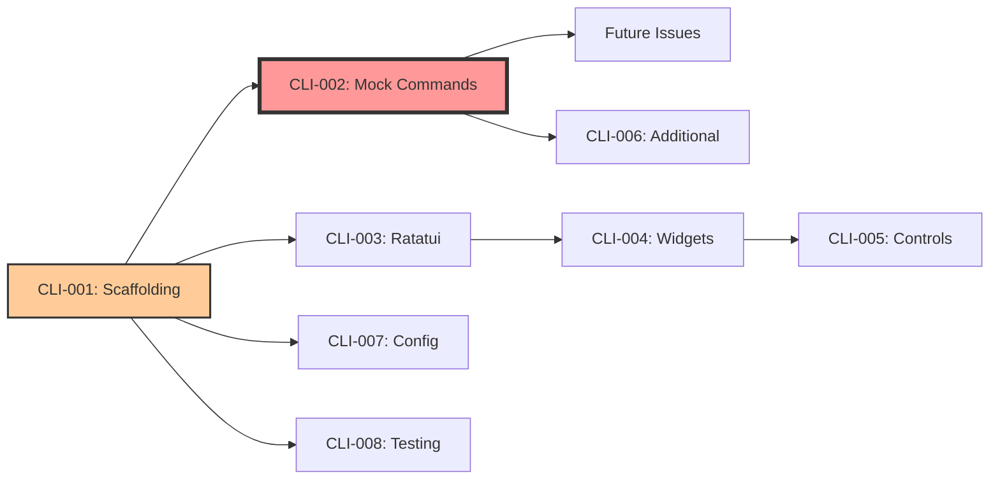

# Orchestrator Status Dashboard

## Current Status: 🟡 WAITING FOR ANSWERS
*Last Updated: Wed Oct 29 03:25:42 EDT 2025*

## 📊 Workstream Overview

### WS-01: CLI/TUI Application (Issues #1-8)
**Status:** ⏸️ PAUSED - Awaiting clarifying question answers
**Progress:** 0/8 issues started
**Agents:** 0 spawned

## 📋 Issue Status Matrix

| Issue | Title | Questions | Status | Agent | Priority |
|-------|-------|-----------|--------|--------|----------|
| #1 | CLI-001: Project Scaffolding | 4 pending | ⏸️ PAUSED | None | Critical |
| #2 | CLI-002: Mock Infrastructure (KEY) | 6 pending | ⏸️ PAUSED | None | Critical |
| #3 | CLI-003: Ratatui Setup | 4 pending | ⏸️ PAUSED | None | High |
| #4 | CLI-004: TUI Widgets | 4 pending | ⏸️ PAUSED | None | High |
| #5 | CLI-005: Interactive Controls | 4 pending | ⏸️ PAUSED | None | Medium |
| #6 | CLI-006: Additional Commands | 4 pending | ⏸️ PAUSED | None | Low |
| #7 | CLI-007: Configuration | 4 pending | ⏸️ PAUSED | None | Low |
| #8 | CLI-008: Testing & Docs | 4 pending | ⏸️ PAUSED | None | Low |

## 🔑 Key Dependencies



## 📝 Clarifying Questions Summary

### Total Questions: 34
- CLI-001: 4 questions (naming, config format, modules, async)
- CLI-002: 6 questions (dependencies, checks, errors, timing, components, progress) **KEY TICKET**
- CLI-003: 4 questions (layout, theme, error display, backend)
- CLI-004: 4 questions (data format, refresh, gauges, history)
- CLI-005: 4 questions (vim keys, copy/paste, focus, panel selection)
- CLI-006: 4 questions (terminal handling, job UI, logging, cancellation)
- CLI-007: 4 questions (profiles, config location, defaults, validation)
- CLI-008: 4 questions (coverage target, doc format, CI pipeline, examples)

## 🤖 Agent Pool Status

### Available Agent Types
- **rust-pro**: Rust development specialist (for CLI/TUI work)
- **tester**: Testing and QA specialist
- **reviewer**: Code review and quality assurance
- **system-architect**: Architecture and design

### Spawned Agents
*None currently spawned - waiting for question answers*

## 📈 Metrics

### Response Times
- Questions posted: 06:21-06:27 UTC (Oct 29)
- Orchestrator activated: 07:25 UTC
- Time waiting: ~1 hour
- Target response time: <4 hours

### Workflow Efficiency
- Agent utilization: 0% (no agents spawned)
- Blocked issues: 8/8 (100%)
- Ready to work: 0/8 (0%)

## 🚦 Next Actions

### Immediate (When Questions Answered)
1. Detect answers on any issue
2. Spawn rust-pro agent for that issue
3. Begin TDD workflow immediately
4. Update status dashboard

### Monitoring Schedule
- Every 5 minutes: Check for new comments/answers
- Every hour: Post status update
- Immediately: Report any blockers

## 🎯 Success Criteria

- [ ] All 34 questions answered
- [ ] 8 development agents spawned
- [ ] All issues transitioned to IN PROGRESS
- [ ] First PR submitted within 24 hours
- [ ] 2-3 issues completed per day

## 📡 Monitoring Command

```bash
# Run monitoring check
/Users/beengud/raibid-labs/raibid-ci/scripts/orchestrator_monitor.sh

# Check specific issue
gh issue view <number> --json comments

# View all issues
gh issue list --state open
```

## 🔄 Last 5 Checks
1. Wed Oct 29 03:25:42 EDT - All waiting (0/8 answered)

---
*Orchestrator Agent v1.0 | Auto-generated Status Report*