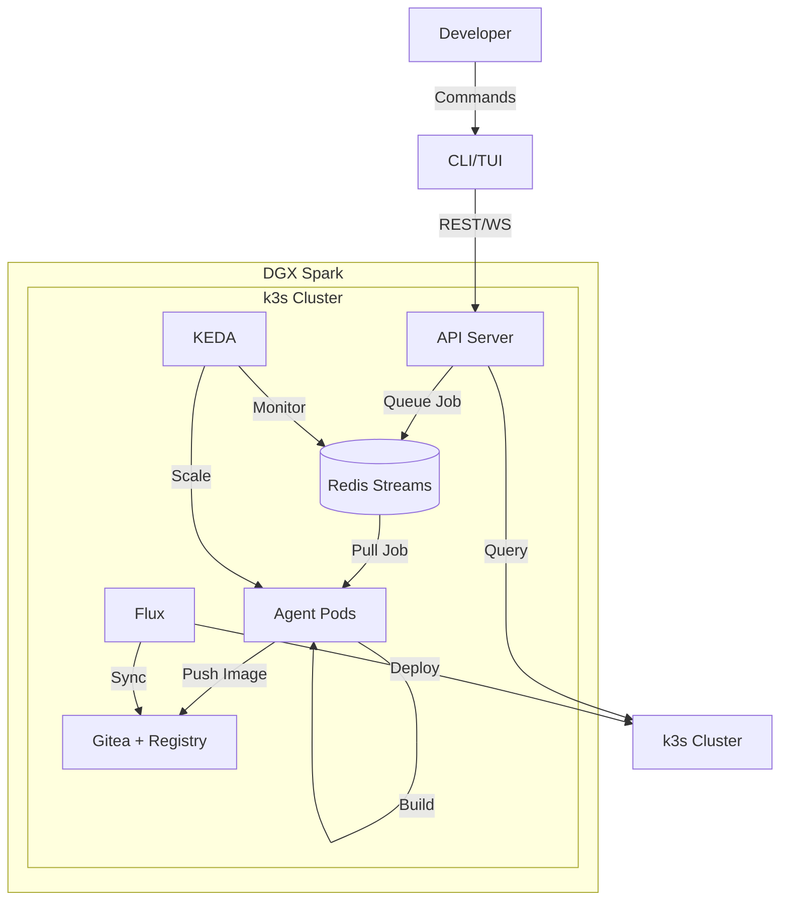

# Architecture Documentation

This directory contains high-level architecture documentation for the raibid-ci system.

## Overview

raibid-ci is an ephemeral, auto-scaling CI agent pool designed for NVIDIA DGX Spark. The architecture is optimized for:
- **Ephemeral agents**: Scale to zero when idle
- **Event-driven scaling**: KEDA monitors Redis queue depth
- **GitOps delivery**: Flux syncs from Gitea
- **TUI-first management**: All operations via terminal interface

## Architecture Documents

### [System Overview](./system-overview.md)
High-level architecture diagram and component relationships.

**Topics:**
- Component diagram
- Data flow
- Network topology
- Deployment architecture

### [Data Flow](./data-flow.md)
How data moves through the system from job submission to completion.

**Topics:**
- Job submission flow
- Build execution flow
- Artifact publishing flow
- Status update flow

### [Scaling Strategy](./scaling.md)
Auto-scaling design using KEDA and HPA.

**Topics:**
- KEDA ScaledObject configuration
- Scaling triggers and thresholds
- Scale-to-zero behavior
- Performance tuning

### [Security Model](./security.md)
Authentication, authorization, and isolation strategies.

**Topics:**
- API authentication (JWT)
- Role-based access control
- Network policies
- Secret management
- Container isolation

### [Orchestration](./orchestration.md)
Multi-agent development orchestration system.

**Topics:**
- Workstream organization
- Agent coordination
- Issue management
- Development workflow

### [Event-Driven Orchestration](./event-driven-orchestration.md)
Event-driven architecture for the orchestrator system.

**Topics:**
- Event sourcing
- GitHub webhooks integration
- Asynchronous processing
- State management

## System Architecture

## Component Overview

### CLI/TUI Layer
- **CLI**: Command-line interface for all operations
- **TUI**: Real-time terminal dashboard with 4 tabs

### API Layer
- **API Server**: REST endpoints and WebSocket connections
- **Job Dispatcher**: Redis Streams producer
- **Agent Manager**: Kubernetes API client

### Data Layer
- **Redis Streams**: Job queue with consumer groups
- **Gitea**: Git repositories and OCI registry
- **k3s etcd**: Kubernetes state store

### Execution Layer
- **Agent Pods**: Containerized build environments
- **Build Cache**: Persistent volumes for caching
- **Build Executor**: Pipeline execution engine

### Orchestration Layer
- **KEDA**: Event-driven autoscaling
- **Flux**: GitOps continuous delivery
- **k3s**: Lightweight Kubernetes

## Key Architectural Decisions

### 1. Ephemeral Agents
**Decision**: Agents scale to zero when idle and spin up on-demand.

**Rationale**:
- Maximize resource efficiency on DGX Spark
- Reduce idle resource consumption
- Enable multi-tenancy with other workloads

**Trade-offs**:
- Cold start latency (10-30 seconds)
- Cache warming on startup

### 2. Redis Streams for Job Queue
**Decision**: Use Redis Streams instead of RabbitMQ or Kafka.

**Rationale**:
- Lightweight footprint (<256MB RAM)
- Consumer groups for parallel processing
- Persistent job history
- Simple operational model

**Trade-offs**:
- Limited to single Redis instance (no clustering)
- Manual backup required

### 3. Gitea for Registry
**Decision**: Use Gitea's integrated OCI registry instead of standalone Harbor or Registry.

**Rationale**:
- Single service for Git and registry
- Reduced operational complexity
- Native webhook integration
- Lower resource usage

**Trade-offs**:
- Limited registry features vs Harbor
- Smaller ecosystem

### 4. KEDA for Autoscaling
**Decision**: Use KEDA instead of native HPA with custom metrics.

**Rationale**:
- Built-in Redis Streams scaler
- Scale-to-zero support
- Event-driven architecture
- Simple configuration

**Trade-offs**:
- Additional controller overhead
- Learning curve for KEDA concepts

### 5. Flux for GitOps
**Decision**: Use Flux instead of ArgoCD.

**Rationale**:
- Lightweight footprint
- Gitea integration
- Progressive delivery support
- Native Kubernetes controller

**Trade-offs**:
- Less mature UI than ArgoCD
- Smaller community

## Design Principles

### 1. Ephemeral by Default
All agents are stateless and disposable. State is stored in Redis and Gitea.

### 2. Auto-scaling First
KEDA drives all scaling decisions. No manual agent management.

### 3. GitOps Everything
All deployments managed by Flux. Infrastructure as code.

### 4. TUI for Control
Terminal UI is the primary interface. GUI is a future consideration.

### 5. Cache Aggressively
Optimize for cache hit rates to minimize build times.

### 6. Rust for Performance
Critical path uses Rust for speed and memory safety.

## Performance Characteristics

### Latency
- **Job submission**: <100ms
- **Agent startup**: 10-30 seconds (cold start)
- **Agent startup**: 2-5 seconds (warm cache)
- **Build execution**: Depends on project (typical: 2-10 minutes)

### Throughput
- **Job queue**: 1000+ jobs/second (Redis Streams)
- **Concurrent builds**: 8 agents max (configurable)
- **Gitea registry**: 100 MB/s push/pull

### Resource Usage
- **Base infrastructure**: ~4 cores, ~4GB RAM
- **Per agent**: ~2 cores, ~4GB RAM
- **Total capacity**: 8 agents = ~20 cores, ~36GB RAM

### Scaling Behavior
- **Scale up**: 10-30 seconds from job submission
- **Scale down**: 5 minutes idle timeout (configurable)
- **Queue processing**: Linear with agent count

## Failure Modes

### Infrastructure Failures
- **k3s crash**: All services down, automatic restart
- **Redis crash**: Jobs lost in-flight, persistent state recovers
- **Gitea crash**: Builds block, automatic retry
- **Network partition**: Agents timeout, jobs requeue

### Application Failures
- **Agent crash**: Job requeued, KEDA scales replacement
- **Build timeout**: Job marked failed, agent terminates
- **API server crash**: Clients reconnect, no job loss

### Recovery Strategies
- **Automatic retry**: Exponential backoff for transient failures
- **Transaction rollback**: Setup failures rollback to previous state
- **Health checks**: Liveness and readiness probes

See [Error Recovery Guide](../error-recovery.md) for detailed recovery procedures.

## Deployment Model

### Single-Node (MVP)
- All components on single DGX Spark
- Simple operational model
- Suitable for personal use or small teams

### Multi-Node (Future)
- k3s cluster across multiple DGX Spark nodes
- Redis Sentinel for HA
- Gitea with external Postgres
- Suitable for large teams or organizations

## Monitoring and Observability

### Metrics
- Prometheus metrics from all components
- Grafana dashboards for visualization
- Alert rules for critical issues

### Logging
- Structured logging with tracing
- Centralized log aggregation
- Log levels: DEBUG, INFO, WARN, ERROR

### Tracing
- Distributed tracing with OpenTelemetry
- End-to-end request tracing
- Performance profiling

## Related Documentation

- [Component Documentation](../components/)
- [Deployment Guides](../guides/)
- [API Reference](../api/)
- [Troubleshooting](../guides/troubleshooting.md)

---

*Last Updated: 2025-11-01*
