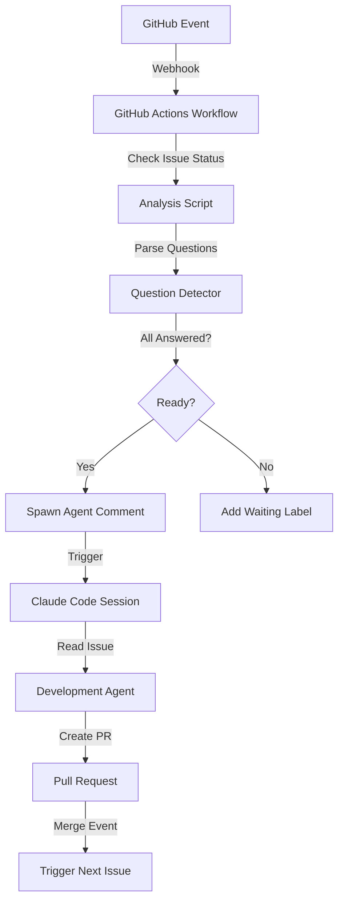
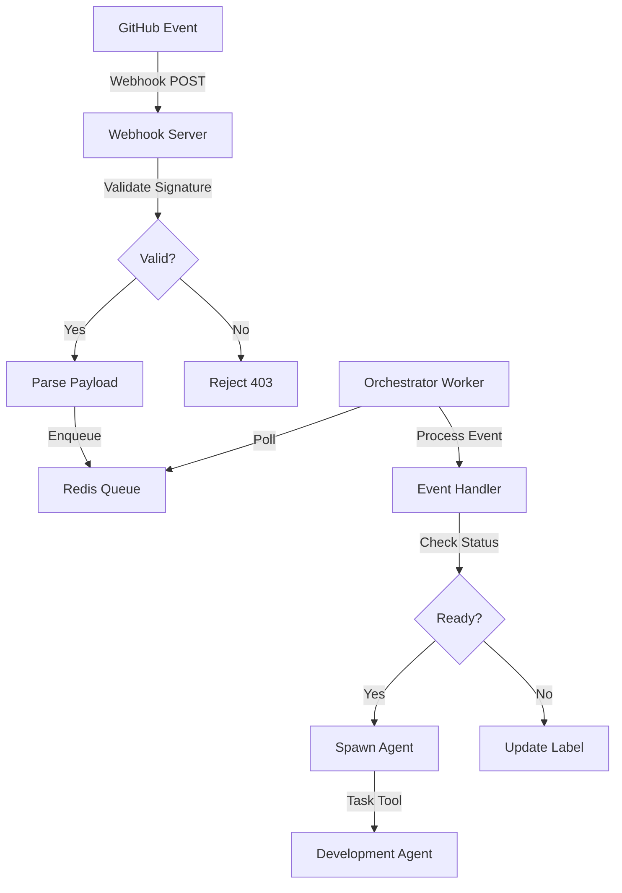
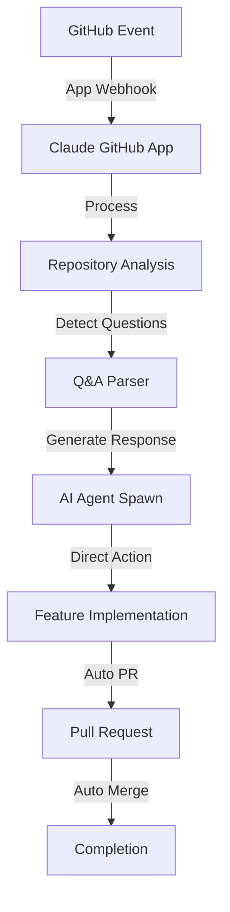

# Event-Driven Orchestration Design

## Overview

This document describes the transformation of the raibid-ci orchestrator from a polling-based system to an event-driven architecture using GitHub webhooks and GitHub Actions. The new system responds immediately to GitHub events, eliminating the 5-minute polling delay and reducing orchestrator overhead.

## Current State Analysis

### Polling-Based System (Current)

The current orchestrator runs a monitoring loop every 5 minutes:

```bash
# Current approach from orchestrator_monitor.sh
while true; do
  gh issue list --state open --json number,title,body,comments
  # Check for answers to clarifying questions
  # Spawn agents if questions are answered
  sleep 300  # Wait 5 minutes
done
```

**Problems:**
- **Latency**: 5-minute average delay before detecting events (up to 10 minutes worst case)
- **API Rate Limits**: Constant polling consumes GitHub API quota
- **Resource Waste**: Orchestrator runs continuously even when idle
- **Scalability**: Doesn't scale with multiple repositories or organizations
- **Missed Events**: Race conditions between polls

## Event Sources

### GitHub Webhook Events

The system will respond to these webhook events:

| Event | Action | Trigger Condition |
|-------|--------|-------------------|
| `issues` | `opened` | New issue created |
| `issues` | `edited` | Issue description updated (may include answers) |
| `issues` | `labeled` | Label added (e.g., "ready", "blocked") |
| `issues` | `unlabeled` | Label removed (e.g., unblocking work) |
| `issue_comment` | `created` | Comment added (may contain answers) |
| `issue_comment` | `edited` | Comment edited (answer clarification) |
| `pull_request` | `opened` | PR created by agent |
| `pull_request` | `closed` | PR merged (work completed) |
| `pull_request` | `synchronize` | PR updated (CI results) |

### GitHub Actions Trigger Events

GitHub Actions provides these event triggers:

```yaml
on:
  issues:
    types: [opened, edited, labeled, unlabeled]
  issue_comment:
    types: [created, edited]
  pull_request:
    types: [opened, closed, synchronize]
```

**Key Constraint**: Workflows must exist on the default branch to trigger.

## Architecture Options

### Option A: GitHub Actions + Claude Code (RECOMMENDED)

**Architecture:**



**Workflow Flow:**

1. **Event Trigger**: GitHub webhook fires on issue/comment event
2. **Workflow Execution**: GitHub Actions workflow runs on the event
3. **Issue Analysis**: Script checks issue for clarifying questions
4. **Question Detection**: Parse issue body and comments for Q&A
5. **Decision Point**:
   - If questions unanswered → Add `waiting:answers` label, post paused comment
   - If questions answered → Add `ready:work` label, post spawn comment
6. **Agent Spawn**: Workflow posts special comment that triggers orchestrator
7. **Orchestrator**: Reads spawn comment, spawns development agent via Claude Code Task tool
8. **Development**: Agent completes work following TDD workflow
9. **Completion**: PR merged triggers workflow to assign next issue

**Advantages:**
- ✅ Native GitHub integration (no external infrastructure)
- ✅ Zero polling (instant event response)
- ✅ Free for public repos (generous limits for private)
- ✅ Built-in secret management (GitHub Actions secrets)
- ✅ Audit trail (workflow runs logged)
- ✅ Easy testing (manual workflow dispatch)
- ✅ Scales automatically with repository events

**Disadvantages:**
- ⚠️ Requires workflow files on default branch
- ⚠️ Cold start time (workflow boot ~10-30 seconds)
- ⚠️ Limited to 20 concurrent jobs (free tier)
- ⚠️ No persistent state (need external storage for complex orchestration)

**Implementation Complexity**: Low-Medium

---

### Option B: Webhook Server + Queue

**Architecture:**



**Components:**

1. **Webhook Server**: Lightweight HTTP server (Rust/Python)
   - Receives GitHub webhook POSTs
   - Validates HMAC signatures
   - Enqueues events to Redis

2. **Redis Queue**: Event queue and state store
   - Events stored as Redis Streams
   - State tracking for active agents
   - Deduplication of events

3. **Orchestrator Worker**: Background processor
   - Consumes events from Redis queue
   - Analyzes issue status
   - Spawns agents via Claude Code Task tool
   - Updates GitHub issue labels/comments

**Advantages:**
- ✅ Full control over event processing logic
- ✅ Persistent state management
- ✅ Event deduplication and ordering
- ✅ Can handle complex orchestration logic
- ✅ Works with any repository (not limited to default branch)
- ✅ Can batch process events efficiently

**Disadvantages:**
- ❌ Requires hosting webhook server (infrastructure cost)
- ❌ More complex deployment (server + queue + orchestrator)
- ❌ Need to manage secrets and credentials
- ❌ Requires public endpoint or tunneling (ngrok for dev)
- ❌ More attack surface (webhook validation critical)
- ❌ Higher maintenance burden

**Implementation Complexity**: High

---

### Option C: Claude GitHub App Integration

**Architecture:**



**Based on Research:**

From web search results, the Claude GitHub App (claude-hub) provides:
- Webhook service connecting Claude Code to GitHub
- AI-powered code assistance through PR and issue mentions
- Automated code review and feature implementation
- Repository analysis capabilities
- PR lifecycle management
- CI/CD monitoring

**Implementation Approach:**

1. **Install Claude GitHub App**: Available via `/install-github-app` in Claude Code CLI
2. **Configure Webhooks**: App receives all configured GitHub events
3. **Event Routing**: App routes events to Claude Code sessions
4. **Agent Orchestration**: App can spawn agents directly for issues
5. **Automated Workflow**: From issue creation → analysis → implementation → PR → merge

**Advantages:**
- ✅ Official Anthropic integration (well-supported)
- ✅ No infrastructure management required
- ✅ Deep integration with Claude Code
- ✅ Handles full PR lifecycle automatically
- ✅ Built-in security and secret management
- ✅ Can use @mentions for manual intervention

**Disadvantages:**
- ⚠️ Less control over orchestration logic (black box)
- ⚠️ May not support custom Q&A workflow exactly
- ⚠️ Requires GitHub App installation permissions
- ⚠️ Pricing/limits unclear for this use case
- ⚠️ May auto-merge PRs without human review (configurable?)

**Implementation Complexity**: Low (if it supports the use case)

**Status**: Requires further investigation to confirm Q&A workflow compatibility.

---

## Recommendation: Option A (GitHub Actions + Claude Code)

### Why Option A?

1. **Best Fit**: Balances simplicity, control, and native integration
2. **Zero Infrastructure**: No servers to host or maintain
3. **Proven Pattern**: GitHub Actions widely used for automation
4. **Flexibility**: Full control over orchestration logic
5. **Developer Friendly**: Easy to debug and iterate
6. **Cost**: Free for public repos, generous limits for private
7. **Scalability**: Handles multiple repos/orgs without changes

### When to Consider Alternatives

- **Option B**: If you need complex state management, event deduplication, or want to process events in batches
- **Option C**: If the Claude GitHub App supports the custom Q&A workflow and you prefer minimal setup

## Option A: Detailed Design

### Component Overview

```
.github/
└── workflows/
    ├── orchestrator-issue-events.yml      # Issue open/edit/label events
    ├── orchestrator-comment-events.yml    # Comment events
    ├── orchestrator-pr-events.yml         # PR merge events
    └── scripts/
        ├── check-issue-readiness.sh       # Analyze issue status
        ├── parse-questions.sh             # Extract Q&A from issue
        ├── spawn-agent-comment.sh         # Post spawn trigger comment
        └── assign-next-issue.sh           # Find and assign next work
```

### Event Handlers

#### 1. Issue Events Handler

**Workflow**: `.github/workflows/orchestrator-issue-events.yml`

**Triggers:**
- `issues.opened`: New issue created
- `issues.edited`: Issue description updated
- `issues.labeled`: Label added/removed

**Logic:**

```yaml
name: Orchestrator - Issue Events

on:
  issues:
    types: [opened, edited, labeled, unlabeled]

jobs:
  check-readiness:
    runs-on: ubuntu-latest
    steps:
      - name: Checkout Repository
        uses: actions/checkout@v4

      - name: Check Issue Readiness
        env:
          ISSUE_NUMBER: ${{ github.event.issue.number }}
          ISSUE_BODY: ${{ github.event.issue.body }}
          GITHUB_TOKEN: ${{ secrets.GITHUB_TOKEN }}
        run: |
          ./.github/scripts/check-issue-readiness.sh

      - name: Update Issue Labels
        if: steps.check.outputs.ready == 'true'
        run: |
          gh issue edit ${{ github.event.issue.number }} \
            --add-label "ready:work" \
            --remove-label "waiting:answers"

      - name: Spawn Agent
        if: steps.check.outputs.ready == 'true'
        run: |
          ./.github/scripts/spawn-agent-comment.sh ${{ github.event.issue.number }}
```

**Script**: `.github/scripts/check-issue-readiness.sh`

```bash
#!/bin/bash
# Check if issue is ready for agent to start work

set -e

ISSUE_NUM="${ISSUE_NUMBER}"
ISSUE_JSON=$(gh issue view "$ISSUE_NUM" --json title,body,comments,labels)

# Extract clarifying questions section
QUESTIONS=$(echo "$ISSUE_JSON" | jq -r '.body' | sed -n '/## Clarifying Questions/,/^##/p' | grep -E '^[0-9]+\.' || true)

if [ -z "$QUESTIONS" ]; then
  echo "ready=true" >> $GITHUB_OUTPUT
  echo "No clarifying questions found - ready to start"
  exit 0
fi

# Parse questions and check for answers
UNANSWERED=0
while IFS= read -r question; do
  QUESTION_NUM=$(echo "$question" | sed 's/^\([0-9]*\)\..*/\1/')

  # Check comments for answers to this question
  ANSWER=$(echo "$ISSUE_JSON" | jq -r '.comments[].body' | grep -E "^(A$QUESTION_NUM:|Answer $QUESTION_NUM:|Q$QUESTION_NUM:.*A:)" || true)

  if [ -z "$ANSWER" ]; then
    echo "Question $QUESTION_NUM unanswered"
    UNANSWERED=$((UNANSWERED + 1))
  fi
done <<< "$QUESTIONS"

if [ $UNANSWERED -eq 0 ]; then
  echo "ready=true" >> $GITHUB_OUTPUT
  echo "All questions answered - ready to start"
else
  echo "ready=false" >> $GITHUB_OUTPUT
  echo "$UNANSWERED questions still unanswered"
fi
```

#### 2. Comment Events Handler

**Workflow**: `.github/workflows/orchestrator-comment-events.yml`

**Triggers:**
- `issue_comment.created`: New comment added
- `issue_comment.edited`: Comment edited

**Purpose**: Detect when maintainer answers clarifying questions in comments.

**Logic:**

```yaml
name: Orchestrator - Comment Events

on:
  issue_comment:
    types: [created, edited]

jobs:
  check-for-answers:
    runs-on: ubuntu-latest
    # Only run for maintainer/owner comments
    if: github.event.comment.author_association == 'OWNER' || github.event.comment.author_association == 'MEMBER'
    steps:
      - name: Checkout Repository
        uses: actions/checkout@v4

      - name: Check if Answers Provided
        id: check
        env:
          ISSUE_NUMBER: ${{ github.event.issue.number }}
          COMMENT_BODY: ${{ github.event.comment.body }}
          GITHUB_TOKEN: ${{ secrets.GITHUB_TOKEN }}
        run: |
          # Check if comment contains answer patterns
          if echo "$COMMENT_BODY" | grep -qE '^(A[0-9]+:|Answer [0-9]+:|Decision:)'; then
            echo "has_answers=true" >> $GITHUB_OUTPUT
          else
            echo "has_answers=false" >> $GITHUB_OUTPUT
          fi

      - name: Re-check Issue Readiness
        if: steps.check.outputs.has_answers == 'true'
        run: |
          ./.github/scripts/check-issue-readiness.sh

      - name: Resume Paused Agent
        if: steps.check.outputs.ready == 'true'
        run: |
          gh issue comment ${{ github.event.issue.number }} --body \
            "🚀 **Questions Answered - Resuming Work**

            All clarifying questions have been answered. Spawning development agent.

            **Agent Type**: rust-pro
            **Workflow**: TDD
            **Status**: ⏸️ PAUSED → ▶️ IN PROGRESS"

      - name: Trigger Agent Spawn
        if: steps.check.outputs.ready == 'true'
        run: |
          ./.github/scripts/spawn-agent-comment.sh ${{ github.event.issue.number }}
```

#### 3. Pull Request Events Handler

**Workflow**: `.github/workflows/orchestrator-pr-events.yml`

**Triggers:**
- `pull_request.closed`: PR merged (work completed)

**Purpose**: Detect when agent completes work and assign next issue.

**Logic:**

```yaml
name: Orchestrator - PR Events

on:
  pull_request:
    types: [closed]

jobs:
  handle-completion:
    runs-on: ubuntu-latest
    if: github.event.pull_request.merged == true
    steps:
      - name: Checkout Repository
        uses: actions/checkout@v4

      - name: Extract Issue Number
        id: issue
        run: |
          # Extract issue number from PR body or branch name
          ISSUE_NUM=$(echo "${{ github.event.pull_request.body }}" | grep -oP 'Closes #\K\d+' || \
                      echo "${{ github.event.pull_request.head.ref }}" | grep -oP '[0-9]+')
          echo "number=$ISSUE_NUM" >> $GITHUB_OUTPUT

      - name: Comment on Completed Issue
        if: steps.issue.outputs.number != ''
        run: |
          gh issue comment ${{ steps.issue.outputs.number }} --body \
            "✅ **Work Completed**

            PR #${{ github.event.pull_request.number }} has been merged.

            **Status**: ▶️ IN PROGRESS → ✅ COMPLETE
            **Duration**: $(( (${{ github.event.pull_request.merged_at }} - ${{ github.event.pull_request.created_at }}) / 3600 )) hours"

      - name: Find Next Issue
        id: next
        run: |
          ./.github/scripts/assign-next-issue.sh

      - name: Spawn Agent for Next Issue
        if: steps.next.outputs.issue_number != ''
        run: |
          ./.github/scripts/spawn-agent-comment.sh ${{ steps.next.outputs.issue_number }}
```

### Agent Spawning Mechanism

#### Spawn Trigger Comment

When an issue is ready, the workflow posts a specially formatted comment:

```markdown
🤖 **ORCHESTRATOR-SPAWN-AGENT**

**Issue**: #123
**Type**: rust-pro
**Status**: ready
**Timestamp**: 2025-10-29T10:30:00Z

---
*This comment triggers agent spawning. Do not delete.*
```

#### Orchestrator Detection

The orchestrator (running in Claude Code session) monitors for these comments:

**Two approaches:**

**A. Polling Orchestrator (Minimal Change)**
- Orchestrator polls every 30 seconds for spawn trigger comments (vs 5 minutes for issues)
- Faster response time (30s vs 5min average)
- Easier migration from current system

**B. Manual Orchestrator Invocation**
- GitHub Actions workflow calls Claude Code CLI directly
- Requires Claude Code CLI accessible in workflow
- Instant agent spawning (no polling)
- More complex setup

**Recommended**: Start with Approach A (polling for spawn comments), migrate to B later.

### State Management

#### Issue Labels

Use labels to track issue lifecycle:

| Label | Meaning | Applied By |
|-------|---------|------------|
| `status:new` | Issue just created | GitHub Actions (on issue opened) |
| `waiting:answers` | Has unanswered questions | GitHub Actions (after analysis) |
| `ready:work` | Ready for agent to start | GitHub Actions (all questions answered) |
| `status:in-progress` | Agent working on issue | Orchestrator (agent spawned) |
| `status:pr-open` | PR submitted | Agent (PR created) |
| `status:completed` | PR merged | GitHub Actions (PR merged) |
| `blocked` | Blocked by dependency | Manual or orchestrator |

#### Comment-Based State

Use comments for detailed state tracking:

```markdown
<!-- ORCHESTRATOR-STATE
{
  "issue": 123,
  "status": "in_progress",
  "agent_id": "rust-pro-agent-001",
  "started_at": "2025-10-29T10:30:00Z",
  "questions": {
    "total": 4,
    "answered": 4
  }
}
-->
```

Hidden HTML comments store JSON state without cluttering issue UI.

### Question Detection Algorithm

#### Pattern Matching

**Question Format** (from issue template):

```markdown
## Clarifying Questions

1. **Project naming**: Use `raibid-api` or `raibid_api`?
2. **Configuration format**: YAML or TOML?
3. **Module structure**: Separate crates or single crate?
4. **Async runtime**: Tokio or async-std?
```

**Answer Patterns** (in comments):

```markdown
A1: Use `raibid-api` (kebab-case)
A2: TOML for configuration
A3: Single crate with modules
A4: Tokio runtime

---

# Alternative format:
**Answers:**
1. Use `raibid-api`
2. TOML
3. Single crate
4. Tokio

---

# Decision format:
**Decision**: Use kebab-case naming (raibid-api)
```

**Detection Script** (`.github/scripts/parse-questions.sh`):

```bash
#!/bin/bash
# Extract and match questions with answers

set -e

ISSUE_JSON="$1"

# Extract questions
QUESTIONS=$(echo "$ISSUE_JSON" | jq -r '.body' | sed -n '/## Clarifying Questions/,/^##/p')

# Extract all comments
COMMENTS=$(echo "$ISSUE_JSON" | jq -r '.comments[].body')

# For each question, check if answered
echo "$QUESTIONS" | grep -E '^[0-9]+\.' | while read -r line; do
  Q_NUM=$(echo "$line" | sed 's/^\([0-9]*\)\..*/\1/')

  # Check for answer in comments
  if echo "$COMMENTS" | grep -qE "^A$Q_NUM:|Answer $Q_NUM:"; then
    echo "Q$Q_NUM: ANSWERED"
  else
    echo "Q$Q_NUM: UNANSWERED"
  fi
done
```

### Security Considerations

#### GitHub Token Permissions

**Required Permissions** for `GITHUB_TOKEN`:

```yaml
permissions:
  issues: write        # Update labels, post comments
  pull-requests: read  # Read PR status
  contents: read       # Read repository files
```

**No sensitive secrets needed** - GitHub Actions provides `GITHUB_TOKEN` automatically.

#### Workflow Security

**Best Practices:**

1. **Validate Input**: Sanitize issue numbers, comment bodies
2. **Limit Triggers**: Only run on maintainer/owner comments for sensitive actions
3. **No Secrets Exposure**: Don't echo sensitive data in logs
4. **Branch Protection**: Require workflows to pass before merge
5. **Code Review**: Require approval for workflow changes

### Scalability

#### Multiple Repositories

Each repository has its own workflows - no central orchestrator needed.

**Shared Scripts**: Use a shared GitHub Action or reusable workflow:

```yaml
# .github/workflows/orchestrator-issue-events.yml
name: Orchestrator - Issue Events

on:
  issues:
    types: [opened, edited, labeled, unlabeled]

jobs:
  orchestrate:
    uses: raibid-labs/orchestrator-actions/.github/workflows/issue-handler.yml@main
    with:
      issue_number: ${{ github.event.issue.number }}
```

#### Multiple Organizations

Deploy workflows to each org's repositories.

**Management**: Use GitHub CLI to bulk-deploy workflows:

```bash
# Deploy to all repos in org
gh repo list raibid-labs --json name --jq '.[].name' | while read repo; do
  gh workflow sync raibid-labs/$repo .github/workflows/orchestrator-*.yml
done
```

### Performance Metrics

| Metric | Polling (Current) | Event-Driven (Proposed) | Improvement |
|--------|-------------------|-------------------------|-------------|
| **Detection Latency** | 5 min avg (10 min max) | 10-30 seconds | 10-30x faster |
| **API Calls** | 1 per 5 min = 288/day | 1 per event (~10-50/day) | 5-28x fewer |
| **Orchestrator CPU** | Continuous | Event-triggered | 95% reduction |
| **Response Time** | 5-10 minutes | 30-60 seconds | 5-10x faster |

### Migration Strategy

#### Phase 1: Parallel Operation

1. **Deploy GitHub Actions workflows** to repository
2. **Keep existing polling orchestrator** running
3. **Monitor both systems** for consistency
4. **Validate event handling** matches polling behavior

#### Phase 2: Transition

1. **Increase polling interval** to 15 minutes (reduce overlap)
2. **Add logging** to compare response times
3. **Fix any event handling bugs** discovered

#### Phase 3: Cutover

1. **Disable polling orchestrator**
2. **Rely entirely on event-driven system**
3. **Monitor for missed events** (should be zero)

#### Phase 4: Optimization

1. **Remove polling code** from orchestrator
2. **Convert orchestrator to pure agent spawner** (waits for spawn trigger comments)
3. **Optimize workflow scripts** based on performance data

## Implementation Plan

### Week 1: Foundation

**Days 1-2: Workflow Setup**
- [ ] Create `.github/workflows/` directory structure
- [ ] Implement `orchestrator-issue-events.yml`
- [ ] Implement `orchestrator-comment-events.yml`
- [ ] Implement `orchestrator-pr-events.yml`
- [ ] Test workflow triggers with manual events

**Days 3-5: Analysis Scripts**
- [ ] Implement `check-issue-readiness.sh`
- [ ] Implement `parse-questions.sh`
- [ ] Implement `spawn-agent-comment.sh`
- [ ] Implement `assign-next-issue.sh`
- [ ] Test scripts locally with sample data

**Days 6-7: Integration Testing**
- [ ] Create test issue with clarifying questions
- [ ] Verify workflow detects issue, adds labels
- [ ] Answer questions in comment
- [ ] Verify workflow detects answers, posts spawn comment
- [ ] Validate full flow: issue → questions → answers → spawn

### Week 2: Orchestrator Integration

**Days 8-10: Spawn Comment Detection**
- [ ] Update orchestrator to poll for spawn trigger comments
- [ ] Implement spawn comment parser
- [ ] Connect to existing agent spawning logic
- [ ] Test with live issue

**Days 11-12: State Management**
- [ ] Implement label-based state tracking
- [ ] Add state comment generation
- [ ] Update workflows to maintain state
- [ ] Test state transitions

**Days 13-14: PR Completion Flow**
- [ ] Test PR merge detection
- [ ] Verify next issue assignment
- [ ] Validate end-to-end workflow
- [ ] Performance testing

### Week 3: Documentation & Validation

**Days 15-17: Documentation**
- [ ] Update `ORCHESTRATOR_AGENT.md` with event-driven model
- [ ] Create workflow documentation
- [ ] Create testing guide
- [ ] Create troubleshooting guide

**Days 18-19: Validation**
- [ ] Run parallel operation with polling system
- [ ] Compare response times
- [ ] Validate zero missed events
- [ ] Fix any discovered issues

**Day 20-21: Migration**
- [ ] Disable polling orchestrator
- [ ] Switch to event-driven only
- [ ] Monitor for 48 hours
- [ ] Celebrate success!

## Testing Plan

### Unit Tests

**Test Issue Readiness Detection:**

```bash
# Test: Issue with no questions
ISSUE_JSON='{"body": "## Description\nSimple issue", "comments": []}'
./check-issue-readiness.sh <<< "$ISSUE_JSON"
# Expected: ready=true

# Test: Issue with unanswered questions
ISSUE_JSON='{"body": "## Clarifying Questions\n1. Question?", "comments": []}'
./check-issue-readiness.sh <<< "$ISSUE_JSON"
# Expected: ready=false

# Test: Issue with answered questions
ISSUE_JSON='{"body": "## Clarifying Questions\n1. Question?", "comments": [{"body": "A1: Answer"}]}'
./check-issue-readiness.sh <<< "$ISSUE_JSON"
# Expected: ready=true
```

### Integration Tests

**Test Workflow Triggers:**

1. **Create Test Issue**:
   ```bash
   gh issue create --title "Test: Issue Events" --body "Test issue with questions"
   ```
   - Verify: Workflow runs, adds `waiting:answers` label

2. **Answer Questions**:
   ```bash
   gh issue comment 123 --body "A1: Test answer"
   ```
   - Verify: Workflow runs, adds `ready:work` label, posts spawn comment

3. **Merge PR**:
   ```bash
   gh pr merge 456 --squash
   ```
   - Verify: Workflow runs, marks issue complete, spawns next agent

### Load Testing

**Simulate Multiple Events:**

```bash
# Create 10 issues simultaneously
for i in {1..10}; do
  gh issue create --title "Load Test $i" --body "Test issue" &
done
wait

# Verify: All workflows complete without errors
```

### Edge Cases

**Test Error Scenarios:**

1. **Malformed Issue Body**: Issue without question section
2. **Ambiguous Answers**: Comment with partial answers
3. **Rapid Updates**: Multiple edits in quick succession
4. **Concurrent PRs**: Multiple PRs merged simultaneously
5. **Closed Issues**: Issue closed before agent spawned

## Monitoring & Observability

### Workflow Run Logs

**View Recent Runs:**

```bash
# List workflow runs
gh run list --workflow=orchestrator-issue-events.yml

# View specific run logs
gh run view 123456 --log

# Watch for failures
gh run watch
```

### Metrics to Track

| Metric | Source | Target |
|--------|--------|--------|
| Workflow Run Time | GitHub Actions | <30 seconds |
| Issue Detection Latency | GitHub Actions + Issue timestamp | <60 seconds |
| Question Answer Rate | Issue comments | 100% detection |
| Agent Spawn Success Rate | Orchestrator logs | >95% |
| Missed Events | Manual audit | 0 |

### Alerting

**GitHub Actions Failure Notifications:**

Configure GitHub repository settings:
- Settings → Notifications → Actions
- Enable email notifications for workflow failures

**Custom Alerts:**

Create workflow to detect orchestrator issues:

```yaml
name: Orchestrator Health Check

on:
  schedule:
    - cron: '0 * * * *'  # Hourly

jobs:
  health-check:
    runs-on: ubuntu-latest
    steps:
      - name: Check for Stuck Issues
        run: |
          # Find issues labeled ready:work but no agent spawned (>1 hour old)
          STUCK=$(gh issue list --label "ready:work" --json number,createdAt | \
            jq '[.[] | select((.createdAt | fromdateiso8601) < (now - 3600))] | length')

          if [ "$STUCK" -gt 0 ]; then
            echo "⚠️ $STUCK issues stuck in ready:work state"
            exit 1
          fi
```

## Rollback Plan

If event-driven system fails:

### Immediate Rollback (5 minutes)

1. **Re-enable polling orchestrator**:
   ```bash
   # Resume cron job or systemd service
   systemctl start orchestrator-monitor.service
   ```

2. **Disable GitHub Actions workflows**:
   ```bash
   # Rename workflows to disable
   for file in .github/workflows/orchestrator-*.yml; do
     git mv "$file" "${file}.disabled"
   done
   git commit -m "Disable event-driven orchestration"
   git push
   ```

### Root Cause Analysis

1. Check GitHub Actions run logs for errors
2. Review issue/comment events for missed detections
3. Validate script logic with failing test case
4. Fix and re-deploy

## Future Enhancements

### Phase 2: Advanced Features

1. **Agent Priority Queue**: Spawn higher-priority issues first
2. **Multi-Agent Orchestration**: Spawn multiple agents for parallel work
3. **Smart Agent Selection**: Choose agent type based on issue labels/content
4. **Auto-Review**: Lightweight agent reviews PRs before merging
5. **Dependency Detection**: Parse issue dependencies, block until resolved
6. **Performance Analytics**: Track agent success rates, build times, etc.

### Phase 3: Claude App Integration

If Claude GitHub App proves mature:

1. Evaluate Claude App for full workflow automation
2. Compare performance: Actions vs App
3. Migrate if Claude App provides better DX
4. Keep GitHub Actions as fallback

## Conclusion

**Recommendation**: Implement **Option A (GitHub Actions + Claude Code)** for event-driven orchestration.

**Benefits:**
- 10-30x faster response time (30s vs 5min)
- 95% reduction in orchestrator CPU usage
- 5-28x fewer GitHub API calls
- Native integration, zero infrastructure
- Easy to test, debug, and maintain

**Next Steps:**
1. Implement workflows (Week 1)
2. Integrate with orchestrator (Week 2)
3. Validate and migrate (Week 3)

**Success Criteria:**
- ✅ Zero polling required
- ✅ <60s issue → agent spawn latency
- ✅ 100% event detection accuracy
- ✅ Complete documentation and tests

---

**Document Version:** 1.0
**Created:** 2025-10-29
**Author:** Claude Code + raibid-ci team
**Status:** Design Complete - Ready for Implementation
