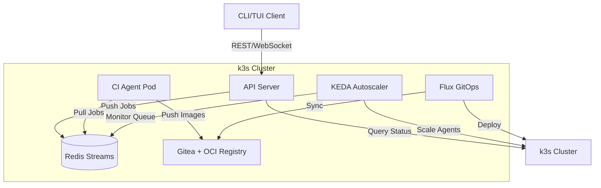

# Component Documentation

This directory contains documentation for each major component of the raibid-ci system.

## Components

### [Server](./server/README.md)
The API server component provides:
- REST API for job management
- WebSocket connections for real-time updates
- Redis Streams job dispatcher
- Kubernetes API integration for agent lifecycle management

**Key Files:**
- Architecture overview
- API implementation details
- Database schemas
- Authentication & authorization

### [CLI](./cli/README.md)
The command-line interface component provides:
- Command parsing and routing
- Configuration management
- Infrastructure setup commands
- Job and agent management commands

**Key Files:**
- Command reference
- Configuration system
- Error handling strategy

### [TUI](./tui/README.md)
The terminal user interface component provides:
- Real-time dashboard with multiple tabs
- Interactive controls and popups
- Event handling and state management
- Data visualization widgets

**Key Files:**
- UI architecture
- Widget catalog
- Event handling
- State management

### [Agent](./agent/README.md)
The CI agent component provides:
- Build execution environment
- Job consumption from Redis Streams
- Build caching and artifact management
- Multi-language support (starting with Rust)

**Key Files:**
- Agent architecture
- Build pipeline
- Caching strategy
- Plugin system

### [Infrastructure](./infrastructure/README.md)
Infrastructure components provide the platform:
- k3s cluster management
- Gitea Git server + OCI registry
- Redis Streams job queue
- KEDA autoscaling
- Flux GitOps continuous delivery

**Key Files:**
- Installation guides
- Configuration references
- Operations playbooks
- Troubleshooting guides

## Architecture Overview



## Component Interactions

### Job Submission Flow
1. User submits job via CLI/TUI
2. API server validates and queues job in Redis Streams
3. KEDA detects queue depth and scales agents
4. Agent pod starts and consumes job
5. Agent executes build and publishes artifacts
6. Agent updates job status in Redis
7. API server streams updates to CLI/TUI

### Configuration Flow
1. User runs `raibid-cli config init`
2. CLI generates default configuration
3. User modifies config file
4. CLI validates configuration
5. Infrastructure components read from config
6. Environment variables override config values

### Scaling Flow
1. Jobs accumulate in Redis Streams
2. KEDA ScaledObject monitors stream lag
3. KEDA calculates desired replica count
4. k3s HPA scales agent deployment
5. New agent pods start and join consumer group
6. Agents process jobs in parallel
7. Idle agents terminate after timeout

## Development Guidelines

### Adding a New Component
1. Create component directory under `components/`
2. Add README.md using [component template](../templates/component-readme.md)
3. Document architecture and key decisions
4. Include code examples and usage patterns
5. Update this README with component summary

### Cross-Component Changes
When changes affect multiple components:
1. Document the change in each affected component
2. Update architecture diagrams
3. Add migration guide if breaking changes
4. Update integration tests

### Documentation Structure
Each component directory should contain:
```
component-name/
├── README.md              # Component overview
├── architecture.md        # Design and structure
├── api.md                # Public interfaces
├── configuration.md       # Config options
├── development.md         # Dev setup
├── operations.md          # Running in production
└── troubleshooting.md     # Common issues
```

## Related Documentation

- [System Architecture](../architecture/system-overview.md)
- [Development Workflow](../workstreams/START_HERE.md)
- [API Reference](../api/)
- [Guides](../guides/)

---

*Last Updated: 2025-11-01*
