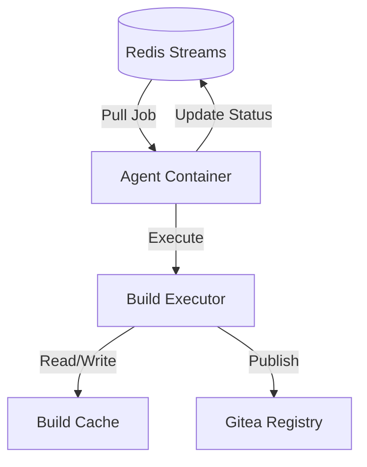

# CI Agent Component

The CI agent is a containerized build environment that consumes jobs from Redis Streams and executes builds.

## Overview

The agent component provides:
- Job consumption from Redis Streams
- Build execution in isolated containers
- Build artifact caching
- Result publishing to Gitea OCI registry
- Multi-language build support (starting with Rust)

## Architecture



## Status

**Current Status**: Planning Phase

This component is part of **WS-02: CI Agent Core** workstream. Implementation will begin after infrastructure is complete.

## Planned Features

### Job Processing
- Pull jobs from Redis Streams consumer group
- Acknowledge job receipt
- Execute build pipeline
- Report progress updates
- Handle timeouts and failures

### Build Execution
- Clone repository from Gitea
- Checkout specific commit/branch/tag
- Execute build steps (defined in `.raibid.yaml`)
- Capture build logs
- Collect artifacts

### Caching Strategy
- **Source cache**: Git repository cache
- **Dependency cache**: Language-specific (cargo, npm, etc.)
- **Build cache**: Incremental compilation artifacts
- **Layer cache**: Docker layer caching

### Container Image
The agent runs as a Kubernetes pod with:
- Base OS: Ubuntu 22.04 (ARM64 + x86_64)
- Build tools: Language-specific toolchains
- Cache volumes: Persistent storage for caches
- Resource limits: Configurable CPU/memory

## Technology Stack

- **Language**: Rust
- **Job Queue**: Redis Streams client
- **Git**: git2-rs
- **Container**: Docker-in-Docker or buildkit
- **Logging**: tracing + structured output

## Configuration

```yaml
agent:
  image: "raibid/rust-builder:latest"
  resources:
    requests:
      cpu: "2"
      memory: "4Gi"
    limits:
      cpu: "4"
      memory: "8Gi"

  cache:
    enabled: true
    path: "/cache"
    size: "50Gi"

  timeout:
    default_minutes: 30
    max_minutes: 120

  redis:
    url: "redis://redis.raibid-ci.svc.cluster.local:6379"
    stream_name: "ci-jobs"
    consumer_group: "ci-workers"
    consumer_name: "${POD_NAME}"
```

## Development

### Project Structure
```
agent/
├── src/
│   ├── consumer/
│   │   ├── redis.rs      # Redis Streams consumer
│   │   ├── ack.rs        # Job acknowledgment
│   │   └── retry.rs      # Retry logic
│   ├── executor/
│   │   ├── build.rs      # Build pipeline
│   │   ├── git.rs        # Repository operations
│   │   ├── cache.rs      # Cache management
│   │   └── logs.rs       # Log streaming
│   ├── config/
│   │   ├── settings.rs   # Agent configuration
│   │   └── pipeline.rs   # Pipeline definition
│   └── main.rs
├── Dockerfile
└── Cargo.toml
```

### Building
```bash
# Build agent
cargo build --package agent

# Build container image
docker build -t raibid/rust-builder:latest -f agent/Dockerfile .

# Cross-compile for ARM64
cargo build --package agent --target aarch64-unknown-linux-gnu
```

### Testing
```bash
# Unit tests
cargo test --package agent --lib

# Integration tests (requires Redis)
cargo test --package agent --test '*'

# Container test
docker run --rm raibid/rust-builder:latest --version
```

## Job Format

Jobs are submitted to Redis Streams in the following format:

```json
{
  "job_id": "job-abc123",
  "repository": "raibid/core",
  "commit": "a1b2c3d4",
  "branch": "main",
  "pipeline": {
    "steps": [
      {
        "name": "test",
        "command": "cargo test --all-features"
      },
      {
        "name": "build",
        "command": "cargo build --release"
      }
    ]
  },
  "timeout_minutes": 30,
  "cache_enabled": true
}
```

## Pipeline Definition

Repositories define build pipelines in `.raibid.yaml`:

```yaml
language: rust
rust_version: "1.75.0"

cache:
  paths:
    - target/
    - ~/.cargo/

steps:
  - name: format-check
    command: cargo fmt --check

  - name: lint
    command: cargo clippy -- -D warnings

  - name: test
    command: cargo test --all-features

  - name: build
    command: cargo build --release

  - name: publish
    command: |
      docker build -t $IMAGE_TAG .
      docker push $IMAGE_TAG
```

## Scaling

Agents scale automatically via KEDA based on Redis queue depth:

```yaml
apiVersion: keda.sh/v1alpha1
kind: ScaledObject
metadata:
  name: ci-agent-scaler
spec:
  scaleTargetRef:
    name: ci-agent
  minReplicaCount: 0
  maxReplicaCount: 8
  triggers:
    - type: redis-streams
      metadata:
        address: redis.raibid-ci.svc.cluster.local:6379
        stream: ci-jobs
        consumerGroup: ci-workers
        lagThreshold: "5"
```

## Lifecycle

1. **Startup**:
   - Register with Redis consumer group
   - Initialize cache volumes
   - Download base images

2. **Job Processing**:
   - Pull job from stream (blocking read)
   - Clone repository
   - Execute pipeline steps
   - Upload artifacts
   - Update job status

3. **Idle**:
   - Wait for jobs (with timeout)
   - Keep-alive heartbeat
   - Cache maintenance

4. **Shutdown**:
   - Finish current job
   - Leave consumer group
   - Clean up resources

## Error Handling

### Retryable Errors
- Network timeouts
- Temporary Git failures
- Registry unavailable

Retry strategy: Exponential backoff (1s, 2s, 4s, 8s, 16s)

### Non-Retryable Errors
- Invalid pipeline definition
- Compilation errors
- Test failures

Action: Mark job as failed, report to API

### Timeout Handling
- Hard timeout: Kill process, mark failed
- Soft timeout: Send warning, extend deadline once

## Resource Management

### CPU Allocation
- **2 cores baseline**: For I/O and orchestration
- **2-4 cores burst**: For parallel compilation

### Memory Allocation
- **4GB baseline**: For build tools and runtime
- **8GB limit**: Prevent OOM on large projects

### Disk Usage
- **10GB ephemeral**: Workspace and temp files
- **50GB cache**: Persistent build cache

## Monitoring

### Metrics
- Jobs processed per hour
- Average build duration
- Cache hit rate
- Resource utilization (CPU, memory, disk)

### Health Checks
- **Liveness**: Process running
- **Readiness**: Connected to Redis
- **Startup**: Cache initialized

## Security

### Isolation
- Each job runs in isolated container
- Network policies restrict egress
- Secrets injected via K8s secrets

### Image Scanning
- Base images scanned for vulnerabilities
- Regular security updates
- Minimal attack surface

## Related Documentation

- [Architecture Overview](../../architecture/system-overview.md)
- [Pipeline Reference](../../guides/pipeline-reference.md)
- [Caching Strategy](../../guides/caching.md)
- [WS-02 Workstream](../../workstreams/02-ci-agent-core/README.md)

## Coming Soon

This component will be implemented as part of:
- **WS-02**: CI Agent Core workstream
- Rust builder image
- Pipeline execution engine
- Cache optimization

Check the [workstreams](../../workstreams/02-ci-agent-core/README.md) directory for development progress.

---

*Last Updated: 2025-11-01*
*Status: Planning Phase*
