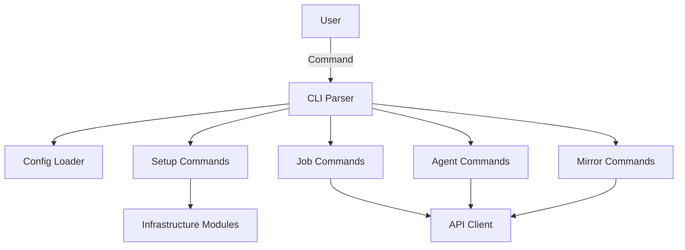

# CLI Component

The command-line interface provides all non-interactive operations for raibid-ci, including infrastructure setup, job management, and configuration.

## Overview

The CLI component provides:
- Command parsing and validation
- Infrastructure provisioning (k3s, Gitea, Redis, KEDA, Flux)
- Job and agent management
- Repository mirroring
- Configuration management

## Architecture



## Status

**Current Status**: Implemented (WS-01 Complete)

The CLI is fully functional with all core commands implemented. See [WS-01 Completion Summary](../../workstreams/COMPLETION_SUMMARY.md).

## Features

### Infrastructure Commands
```bash
# Setup
raibid-cli setup k3s
raibid-cli setup gitea
raibid-cli setup redis
raibid-cli setup keda
raibid-cli setup flux
raibid-cli setup all

# Teardown
raibid-cli teardown <component>
raibid-cli teardown all

# Status
raibid-cli status
raibid-cli status <component>
```

### Job Management
```bash
# List jobs
raibid-cli job list
raibid-cli job list --status running
raibid-cli job list --repo owner/repo

# View job
raibid-cli job show <job-id>

# Manage jobs
raibid-cli job cancel <job-id>
raibid-cli job retry <job-id>
```

### Agent Management
```bash
# List agents
raibid-cli agent list
raibid-cli agent list --status idle

# View agent
raibid-cli agent show <agent-id>

# Manage agents
raibid-cli agent restart <agent-id>
raibid-cli agent scale --count 5
```

### Repository Mirroring
```bash
# Add mirror
raibid-cli mirror add github.com/user/repo

# List mirrors
raibid-cli mirror list

# Sync mirror
raibid-cli mirror sync github.com/user/repo

# Remove mirror
raibid-cli mirror remove github.com/user/repo
```

### Configuration
```bash
# Initialize config
raibid-cli config init

# Show config
raibid-cli config show
raibid-cli config show --format json

# Validate config
raibid-cli config validate

# Show config path
raibid-cli config path
```

## Technology Stack

- **CLI Framework**: clap v4 with derive macros
- **Config**: serde_yaml, toml, serde_json
- **HTTP Client**: reqwest
- **K8s Client**: kube-rs
- **Error Handling**: anyhow, thiserror
- **Logging**: tracing, tracing-subscriber
- **Terminal**: colored, dialoguer, comfy-table

## Configuration

The CLI loads configuration from multiple sources (highest priority first):

1. **Environment variables** - `RAIBID_*` prefix
2. **Local file** - `./raibid.yaml`
3. **User file** - `~/.config/raibid/config.yaml`
4. **System file** - `/etc/raibid/config.yaml`
5. **Built-in defaults**

Example configuration:
```yaml
cluster:
  name: "dgx-spark-ci"
  namespace: "raibid-ci"

api:
  host: "localhost"
  port: 8080

agents:
  min_count: 0
  max_count: 8
  idle_timeout_minutes: 5
```

## Development

### Project Structure
```
cli/
├── src/
│   ├── cli.rs           # Command definitions
│   ├── commands/
│   │   ├── config.rs    # Config management
│   │   ├── setup.rs     # Infrastructure setup
│   │   ├── teardown.rs  # Infrastructure teardown
│   │   ├── status.rs    # Status checking
│   │   ├── job.rs       # Job management
│   │   ├── agent.rs     # Agent management
│   │   └── mirror.rs    # Repository mirroring
│   └── lib.rs
└── Cargo.toml
```

### Building
```bash
# Build CLI
cargo build --package cli

# Run tests
cargo test --package cli

# Run CLI
cargo run --package cli -- --help
```

### Testing
```bash
# Unit tests
cargo test --package cli --lib

# Integration tests
cargo test --package cli --test cli_test

# Specific command tests
cargo test --package cli test_setup_command
```

## Command Reference

See [User Guide](../../USER_GUIDE.md) for complete command reference with examples.

## Error Handling

The CLI implements comprehensive error handling:
- **Validation errors**: Invalid arguments, missing config
- **Infrastructure errors**: k3s setup failures, network issues
- **API errors**: Connection refused, timeouts
- **User errors**: Graceful error messages with suggestions

Error recovery strategies:
- Automatic retry with exponential backoff
- Transaction-based rollback for setup failures
- Detailed error messages with troubleshooting hints

See [Error Recovery Guide](../../guides/error-recovery.md) for details.

## Related Documentation

- [User Guide](../../USER_GUIDE.md)
- [WS-01 Workstream](../../workstreams/01-cli-tui-application/README.md)

---

*Last Updated: 2025-11-01*
*Status: Implemented (WS-01 Complete)*
