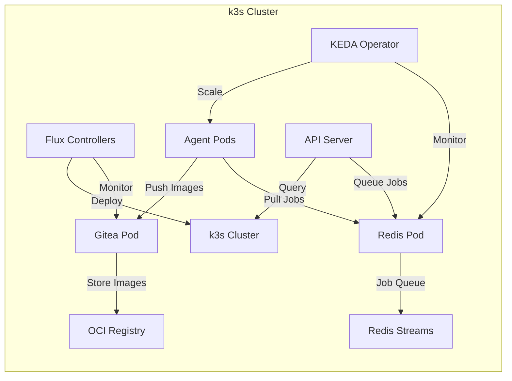

# Infrastructure Components

This directory contains documentation for all infrastructure components that run on the k3s cluster.

## Overview

The raibid-ci infrastructure consists of five main components:

1. **k3s** - Lightweight Kubernetes distribution
2. **Gitea** - Git server with OCI registry
3. **Redis** - Job queue via Redis Streams
4. **KEDA** - Event-driven autoscaling
5. **Flux** - GitOps continuous delivery

## Components

### [k3s Cluster](./k3s.md)
Lightweight Kubernetes cluster optimized for DGX Spark ARM64 architecture.

**Features:**
- Single-node or multi-node deployment
- ARM64 native support
- Rootless mode option
- Low resource overhead (~500MB RAM)

**Key Operations:**
- Installation and bootstrapping
- Node management
- Cluster upgrades
- Troubleshooting

### [Gitea + OCI Registry](./gitea.md)
Self-hosted Git service with integrated container registry.

**Features:**
- Git repository hosting
- OCI-compliant container registry
- Webhook support for CI triggers
- Repository mirroring from GitHub

**Key Operations:**
- Installation via Helm
- User and organization management
- Webhook configuration
- Registry authentication

### [Redis Streams](./redis-deployment.md) | [Usage Guide](./redis-usage.md)
Job queue system using Redis Streams for reliable message delivery.

**Features:**
- Consumer groups for parallel processing
- Persistent job history
- Job acknowledgment and retries
- Queue depth monitoring

**Key Operations:**
- Deployment on k3s
- Consumer group setup
- Monitoring queue depth
- Troubleshooting connection issues

### [KEDA Autoscaler](./keda.md)
Event-driven autoscaling for agent pods based on Redis queue depth.

**Features:**
- Scale from 0 to N agents
- Redis Streams trigger
- Configurable scaling thresholds
- Horizontal Pod Autoscaler integration

**Key Operations:**
- Installation and configuration
- ScaledObject creation
- Monitoring autoscaling events
- Tuning scaling parameters

### [Flux GitOps](./flux.md)
Continuous delivery system that syncs deployments from Gitea repository.

**Features:**
- Git-based deployment automation
- Kustomize and Helm support
- Automatic reconciliation
- Multi-tenancy with namespaces

**Key Operations:**
- Bootstrap with Gitea
- Repository structure
- Deployment workflows
- Troubleshooting sync issues

## Architecture



## Installation Sequence

The components must be installed in the following order due to dependencies:

1. **k3s** - Base cluster (no dependencies)
2. **Redis** - Job queue (depends on k3s)
3. **Gitea** - Git server (depends on k3s)
4. **Flux** - GitOps (depends on k3s, Gitea)
5. **KEDA** - Autoscaler (depends on k3s, Redis)

### Quick Install
```bash
# Install all components in correct order
raibid-cli setup all

# Or install individually
raibid-cli setup k3s
raibid-cli setup redis
raibid-cli setup gitea
raibid-cli setup flux
raibid-cli setup keda
```

### Manual Install
See individual component guides for detailed manual installation steps.

## Configuration

### Infrastructure Config File
```yaml
# ~/.config/raibid/config.yaml
cluster:
  name: "dgx-spark-ci"
  namespace: "raibid-ci"
  kubeconfig: "~/.kube/config"

k3s:
  version: "v1.28.5+k3s1"
  data_dir: "/var/lib/rancher/k3s"
  rootless: false

gitea:
  url: "http://gitea.raibid-ci.svc.cluster.local:3000"
  admin_user: "admin"
  chart_version: "9.5.0"

redis:
  url: "redis://redis.raibid-ci.svc.cluster.local:6379"
  stream_name: "ci-jobs"
  consumer_group: "ci-workers"

keda:
  version: "2.12.0"
  polling_interval: 10

flux:
  version: "v2.2.0"
  git_repo: "http://gitea.raibid-ci.svc.cluster.local:3000/raibid/cluster-config"
```

## Operations

### Status Checking
```bash
# Check all infrastructure status
raibid-cli status

# Check specific component
raibid-cli status k3s
raibid-cli status gitea
raibid-cli status redis
raibid-cli status keda
raibid-cli status flux
```

### Logs and Debugging
```bash
# View component logs
kubectl logs -n raibid-ci deployment/gitea
kubectl logs -n raibid-ci deployment/redis
kubectl logs -n keda deployment/keda-operator

# Check Flux status
flux get all -n raibid-ci

# Check KEDA scaling
kubectl get scaledobjects -n raibid-ci
kubectl get hpa -n raibid-ci
```

### Teardown
```bash
# Remove all infrastructure
raibid-cli teardown all

# Remove specific component
raibid-cli teardown keda
raibid-cli teardown flux
raibid-ci teardown gitea
raibid-cli teardown redis
raibid-cli teardown k3s
```

## Troubleshooting

### Common Issues

**k3s won't start:**
- Check port conflicts (6443, 8443)
- Verify user permissions for rootless mode
- Check disk space in data directory

**Gitea can't connect:**
- Verify pod is running: `kubectl get pods -n raibid-ci`
- Check service: `kubectl get svc -n raibid-ci`
- Test connectivity: `curl http://gitea.raibid-ci.svc.cluster.local:3000`

**Redis connection refused:**
- Check pod status: `kubectl get pods -n raibid-ci -l app=redis`
- Verify service endpoint: `kubectl get endpoints -n raibid-ci redis`
- Test from pod: `kubectl exec -it <pod> -- redis-cli ping`

**KEDA not scaling:**
- Check ScaledObject: `kubectl describe scaledobject <name> -n raibid-ci`
- Verify Redis connection in KEDA logs
- Check queue depth: `redis-cli XLEN ci-jobs`

**Flux not syncing:**
- Check reconciliation: `flux get sources git -n raibid-ci`
- View Flux logs: `flux logs -n flux-system`
- Force sync: `flux reconcile source git <name>`

For detailed troubleshooting, see [Error Recovery Guide](../../error-recovery.md).

## Resource Requirements

### Minimum per Component
- **k3s**: 1 core, 512MB RAM
- **Gitea**: 0.5 core, 512MB RAM
- **Redis**: 0.25 core, 256MB RAM
- **KEDA**: 0.1 core, 128MB RAM
- **Flux**: 0.2 core, 256MB RAM

**Total Base**: ~2 cores, ~1.7GB RAM

### Recommended for Production
- **k3s**: 2 cores, 2GB RAM
- **Gitea**: 1 core, 1GB RAM
- **Redis**: 0.5 core, 512MB RAM
- **KEDA**: 0.2 core, 256MB RAM
- **Flux**: 0.3 core, 512MB RAM

**Total Base**: ~4 cores, ~4.2GB RAM

**Note**: Agent pods require additional resources (2 cores, 4GB RAM each)

## Related Documentation

- [User Guide](../../USER_GUIDE.md)
- [Setup Guide](../../guides/infrastructure-setup.md)
- [Troubleshooting](../../guides/troubleshooting.md)
- [Architecture](../../architecture/system-overview.md)

---

*Last Updated: 2025-11-01*
