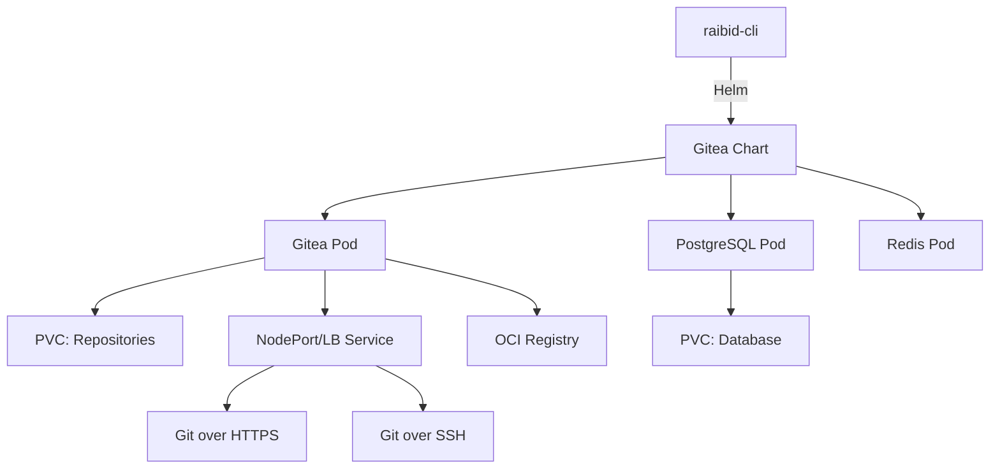

# Gitea Installation Guide

## Overview

The Gitea installer module provides automated deployment of Gitea Git server with OCI registry support on k3s clusters. This implementation follows the established pattern from the k3s installer and provides a production-ready Git hosting solution.

## Features

- **Helm-based Deployment**: Uses official Gitea Helm chart for reliable installation
- **OCI Registry Support**: Built-in container registry for storing Docker/OCI images
- **Persistent Storage**: Configurable persistent volumes for Git repositories and database
- **PostgreSQL Database**: Bundled PostgreSQL for data persistence
- **Redis Cache**: Integrated Redis for caching and queuing
- **Automatic Admin Setup**: Creates admin account with secure random password
- **Multiple Service Types**: Support for NodePort, LoadBalancer, or ClusterIP
- **Git Operations**: Full Git support over SSH and HTTPS
- **Webhooks**: Webhook support for CI integration
- **Actions Support**: Gitea Actions enabled for CI/CD workflows
- **Rollback Support**: Automatic rollback on installation failure

## Architecture



## Prerequisites

- k3s cluster running and accessible
- kubectl configured with cluster access
- Helm 3 (will be auto-installed if missing)
- At least 15Gi available storage for default configuration

## Usage

### Basic Installation

```bash
raibid-cli setup gitea
```

This will:
1. Check prerequisites (kubectl, k3s cluster)
2. Install Helm if not present
3. Create `gitea` namespace
4. Add Gitea Helm repository
5. Deploy Gitea with PostgreSQL and Redis
6. Wait for all pods to be ready (up to 10 minutes)
7. Validate the installation
8. Display access credentials and URL

### Configuration Options

The Gitea installer can be customized via `GiteaConfig`:

```rust
use raibid_cli::infrastructure::{GiteaInstaller, GiteaConfig, ServiceType};

let config = GiteaConfig {
    version: "10.1.4".to_string(),
    namespace: "gitea".to_string(),
    release_name: "gitea".to_string(),
    admin_user: "admin".to_string(),
    admin_password: "secure-password".to_string(),
    admin_email: "admin@example.com".to_string(),
    storage_size: "20Gi".to_string(),
    storage_class: "local-path".to_string(),
    enable_oci_registry: true,
    service_type: ServiceType::LoadBalancer,
    http_node_port: Some(30080),
    ssh_node_port: Some(30022),
    kubeconfig_path: home.join(".kube/config"),
};

let installer = GiteaInstaller::with_config(config)?;
```

### Service Type Options

#### NodePort (Default)
- Exposes Gitea on static ports on all cluster nodes
- HTTP: Port 30080
- SSH: Port 22 (mapped to 30022 externally)
- Best for development and single-node clusters

#### LoadBalancer
- Provisions external load balancer (requires cloud provider support)
- Gets external IP automatically
- Best for production multi-node clusters

#### ClusterIP
- Internal cluster access only
- Requires port-forwarding for external access
- Best for testing or internal-only deployments

## Default Configuration

| Setting | Default Value |
|---------|---------------|
| Chart Version | 10.1.4 |
| Namespace | gitea |
| Release Name | gitea |
| Admin User | raibid-admin |
| Admin Password | Random 16-char string |
| Repository Storage | 10Gi |
| Database Storage | 5Gi |
| Storage Class | local-path (k3s default) |
| Service Type | NodePort |
| HTTP Port | 30080 |
| SSH Port | 30022 |
| OCI Registry | Enabled |

## Accessing Gitea

After installation, you'll see output like:

```
Gitea Access Information:
  → URL: http://localhost:30080
  → Admin username: raibid-admin
  → Admin password: xY9#mK2$pL5@wQ3!

⚠ Please save these credentials securely!
```

### Web Interface

1. Open the URL in your browser
2. Log in with the provided admin credentials
3. Create your first repository

### Git Operations

```bash
# Clone over HTTPS
git clone http://localhost:30080/username/repo.git

# Clone over SSH (if exposed)
git clone ssh://git@localhost:30022/username/repo.git

# Push changes
cd repo
git add .
git commit -m "Update"
git push origin main
```

### OCI Registry

The OCI registry is accessible at:

```bash
# Login to registry
docker login localhost:30080 -u raibid-admin -p <password>

# Tag and push image
docker tag myimage:latest localhost:30080/username/myimage:latest
docker push localhost:30080/username/myimage:latest

# Pull image
docker pull localhost:30080/username/myimage:latest
```

## Storage

Gitea uses persistent volumes for:

1. **Git Repositories** (10Gi default)
   - Path: `/data/git/repositories`
   - Contains all Git repository data

2. **PostgreSQL Database** (5Gi default)
   - Stores Gitea metadata, users, issues, etc.

3. **Attachments and LFS** (part of repository storage)
   - Issue attachments
   - Git LFS objects

Storage is managed by k3s local-path provisioner by default, which creates volumes on the host filesystem.

## Webhooks

Gitea webhooks are configured to allow any host and skip TLS verification for internal k3s services:

```yaml
webhook:
  ALLOWED_HOST_LIST: "*"
  SKIP_TLS_VERIFY: true
```

This enables integration with CI agents running in the same cluster.

## Gitea Actions

Gitea Actions (GitHub Actions compatible) are enabled by default:

```yaml
actions:
  ENABLED: true
```

You can create `.gitea/workflows/*.yaml` files in your repositories to define CI/CD pipelines.

## Validation

The installer performs several validation checks:

1. **Helm Release**: Verifies the release exists
2. **Pod Status**: Ensures all pods are Running
3. **Service Exposure**: Confirms service is accessible
4. **Database Connection**: PostgreSQL is ready

## Troubleshooting

### Installation Hangs

If installation takes longer than 10 minutes:

```bash
# Check pod status
kubectl get pods -n gitea

# Check pod logs
kubectl logs -n gitea -l app.kubernetes.io/name=gitea

# Check events
kubectl get events -n gitea --sort-by='.lastTimestamp'
```

### Pods Not Starting

Common issues:

1. **Storage**: Ensure sufficient disk space
   ```bash
   df -h
   ```

2. **Resources**: Check if cluster has enough memory/CPU
   ```bash
   kubectl top nodes
   ```

3. **Image Pull**: Verify internet connectivity for pulling images
   ```bash
   kubectl describe pod -n gitea <pod-name>
   ```

### Can't Access Gitea

1. **NodePort**: Ensure firewall allows traffic on port 30080
   ```bash
   sudo ufw status
   sudo ufw allow 30080/tcp
   ```

2. **LoadBalancer**: Check external IP is assigned
   ```bash
   kubectl get svc -n gitea
   ```

3. **ClusterIP**: Use port-forward
   ```bash
   kubectl port-forward -n gitea svc/gitea-http 3000:3000
   ```

### Reset Admin Password

If you lose the admin password:

```bash
# Enter Gitea pod
kubectl exec -it -n gitea <gitea-pod-name> -- /bin/sh

# Run admin command
gitea admin user change-password --username raibid-admin --password newpassword
```

## Rollback

If installation fails, the installer automatically rolls back:

1. Uninstalls the Helm release
2. Deletes the namespace (including all PVCs)
3. Cleans up temporary files

Manual rollback:

```bash
# Uninstall Gitea
helm uninstall gitea -n gitea

# Delete namespace
kubectl delete namespace gitea

# Clean up PVCs if needed
kubectl delete pvc -n gitea --all
```

## Upgrading

To upgrade Gitea to a newer version:

```rust
let config = GiteaConfig {
    version: "10.2.0".to_string(),  // New version
    ..Default::default()
};

let installer = GiteaInstaller::with_config(config)?;
// Run install - Helm will upgrade the existing release
```

Or via Helm directly:

```bash
helm upgrade gitea gitea-charts/gitea \
  --namespace gitea \
  --version 10.2.0 \
  --reuse-values
```

## Uninstallation

To completely remove Gitea:

```bash
# Using raibid-cli
raibid-cli teardown gitea

# Or manually
helm uninstall gitea -n gitea
kubectl delete namespace gitea
```

**Warning**: This will delete all repositories and data unless you backup first.

## Backup and Restore

### Backup

```bash
# Backup repositories
kubectl exec -n gitea <gitea-pod> -- tar czf /tmp/repos.tar.gz /data/git/repositories
kubectl cp gitea/<gitea-pod>:/tmp/repos.tar.gz ./repos-backup.tar.gz

# Backup database
kubectl exec -n gitea <postgres-pod> -- pg_dump -U gitea gitea > gitea-db-backup.sql
```

### Restore

```bash
# Restore repositories
kubectl cp ./repos-backup.tar.gz gitea/<gitea-pod>:/tmp/repos.tar.gz
kubectl exec -n gitea <gitea-pod> -- tar xzf /tmp/repos.tar.gz -C /

# Restore database
kubectl cp ./gitea-db-backup.sql gitea/<postgres-pod>:/tmp/backup.sql
kubectl exec -n gitea <postgres-pod> -- psql -U gitea gitea < /tmp/backup.sql
```

## Integration with raibid-cli

Gitea is a core component of the raibid-ci system:

1. **Source of Truth**: Hosts all repositories and CI configurations
2. **Webhook Source**: Triggers CI job queue via webhooks
3. **Registry**: Stores built container images
4. **Actions Runner**: Executes CI jobs via Gitea Actions

Dependencies:
- **k3s**: Required for running Gitea pods
- **Flux**: Pulls configuration from Gitea (later component)

## API Reference

### GiteaInstaller

Main installer struct with methods:

```rust
// Create installer
let installer = GiteaInstaller::new()?;
let installer = GiteaInstaller::with_config(config)?;

// Installation methods
installer.check_kubectl()?;
installer.check_helm()?;
installer.install_helm()?;
installer.create_namespace()?;
installer.add_helm_repo()?;
installer.deploy_helm_chart()?;
installer.wait_for_ready()?;
installer.validate_installation()?;

// Get information
let service_info = installer.get_service_info()?;
let (user, pass) = installer.get_credentials();

// Cleanup
installer.cleanup()?;
installer.rollback()?;
```

### ServiceInfo

Information about deployed Gitea service:

```rust
pub struct ServiceInfo {
    pub service_type: String,
    pub node_port: Option<u16>,
    pub load_balancer_ip: Option<String>,
    pub namespace: String,
}

impl ServiceInfo {
    pub fn access_url(&self) -> String;
}
```

## Testing

Run tests:

```bash
# Unit tests
cargo test --lib gitea

# Integration tests (requires k3s cluster)
cargo test --test gitea_integration

# Skip network tests
SKIP_NETWORK_TESTS=1 cargo test
```

## Security Considerations

1. **Admin Password**: Randomly generated 16-character password
2. **Database Password**: Hardcoded (should be configurable in production)
3. **TLS**: Not enabled by default (add ingress with cert-manager for production)
4. **Network Policies**: Not configured (consider adding for production)
5. **RBAC**: Uses default service account (customize for least privilege)

## Production Recommendations

For production deployments:

1. Use LoadBalancer service type with proper DNS
2. Enable TLS via Ingress + cert-manager
3. Configure external PostgreSQL database
4. Set up backup automation
5. Configure resource limits and requests
6. Enable network policies
7. Use secrets management (not environment variables)
8. Set up monitoring and alerting
9. Configure authentication (LDAP/OAuth)

## References

- [Gitea Documentation](https://docs.gitea.io/)
- [Gitea Helm Chart](https://gitea.com/gitea/helm-chart)
- [Gitea Actions](https://docs.gitea.io/en-us/usage/actions/overview/)
- [k3s Documentation](https://docs.k3s.io/)
- [Helm Documentation](https://helm.sh/docs/)
