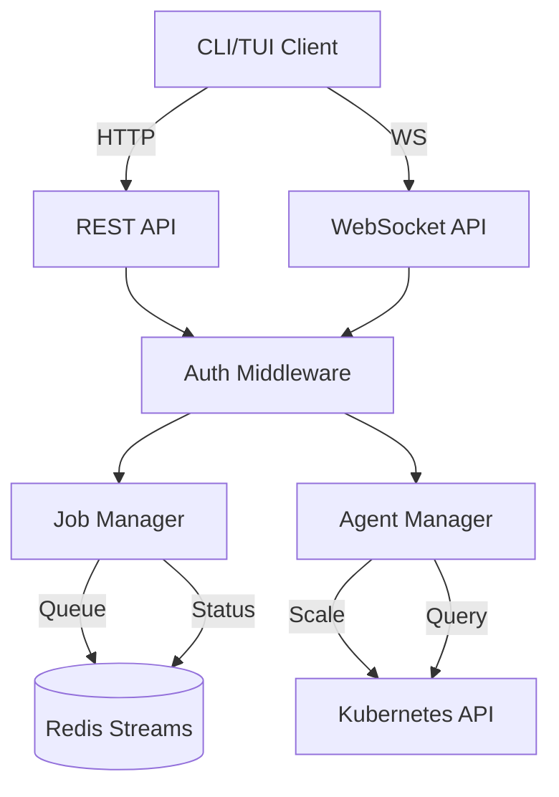

# API Server Component

The API server is the central orchestration component that handles job management, agent lifecycle, and client communication.

## Overview

The API server provides:
- REST API for job submission and management
- WebSocket API for real-time status updates
- Redis Streams job dispatcher
- Kubernetes API integration for agent scaling
- Authentication and authorization

## Architecture



## Status

**Current Status**: Planning Phase

This component is part of **WS-03: API Services** workstream. Implementation will begin after workspace restructuring (issues #42 and #43).

## Planned Features

### REST API Endpoints

#### Job Management
- `POST /api/v1/jobs` - Submit new job
- `GET /api/v1/jobs` - List jobs (with filtering)
- `GET /api/v1/jobs/:id` - Get job details
- `DELETE /api/v1/jobs/:id` - Cancel job
- `POST /api/v1/jobs/:id/retry` - Retry failed job

#### Agent Management
- `GET /api/v1/agents` - List agents
- `GET /api/v1/agents/:id` - Get agent details
- `POST /api/v1/agents/:id/restart` - Restart agent
- `POST /api/v1/agents/scale` - Scale agent count

#### Repository Management
- `POST /api/v1/mirrors` - Add repository mirror
- `GET /api/v1/mirrors` - List mirrors
- `POST /api/v1/mirrors/:id/sync` - Sync repository
- `DELETE /api/v1/mirrors/:id` - Remove mirror

### WebSocket API

Real-time event streaming:
- Job status updates
- Agent status changes
- Build log streaming
- Queue depth metrics

### Technology Stack

- **Framework**: Axum (Rust async web framework)
- **Serialization**: serde_json
- **Database**: Redis Streams (job queue)
- **K8s Client**: kube-rs
- **Authentication**: JWT tokens
- **Logging**: tracing + tracing-subscriber

## Configuration

```yaml
api:
  host: "0.0.0.0"
  port: 8080
  timeout_seconds: 30
  max_connections: 1000

auth:
  jwt_secret: "${RAIBID_JWT_SECRET}"
  token_expiry_hours: 24

redis:
  url: "redis://redis.raibid-ci.svc.cluster.local:6379"
  stream_name: "ci-jobs"
  consumer_group: "ci-workers"

kubernetes:
  kubeconfig: "~/.kube/config"
  namespace: "raibid-ci"
```

## Development

### Project Structure
```
server/
├── src/
│   ├── api/
│   │   ├── rest/         # REST endpoint handlers
│   │   ├── websocket/    # WebSocket handlers
│   │   └── middleware/   # Auth, logging, CORS
│   ├── jobs/
│   │   ├── dispatcher.rs # Job queue management
│   │   ├── executor.rs   # Job lifecycle
│   │   └── status.rs     # Status tracking
│   ├── agents/
│   │   ├── manager.rs    # Agent lifecycle
│   │   ├── scaler.rs     # Scaling logic
│   │   └── monitor.rs    # Health checking
│   ├── config/
│   │   └── settings.rs   # Configuration loading
│   └── main.rs
├── tests/
│   ├── integration/
│   └── unit/
└── Cargo.toml
```

### Building
```bash
# Build server
cargo build --package server

# Run tests
cargo test --package server

# Run server
cargo run --package server
```

### Testing
```bash
# Unit tests
cargo test --package server --lib

# Integration tests
cargo test --package server --test '*'

# API endpoint tests
cargo test --package server test_api
```

## API Reference

See [REST API Documentation](../../api/rest-api.md) for complete endpoint reference.

See [WebSocket API Documentation](../../api/websocket.md) for WebSocket protocol.

## Related Documentation

- [Architecture Overview](../../architecture/system-overview.md)
- [Data Flow](../../architecture/data-flow.md)
- [Authentication](../../architecture/security.md)
- [WS-03 Workstream](../../workstreams/03-api-services/README.md)

## Coming Soon

This component will be implemented as part of:
- **Issue #42**: Cargo workspace structure
- **Issue #43**: Infrastructure/application separation
- **WS-03**: API Services workstream

Check the [workstreams](../../workstreams/03-api-services/README.md) directory for development progress.

---

*Last Updated: 2025-11-01*
*Status: Planning Phase*
