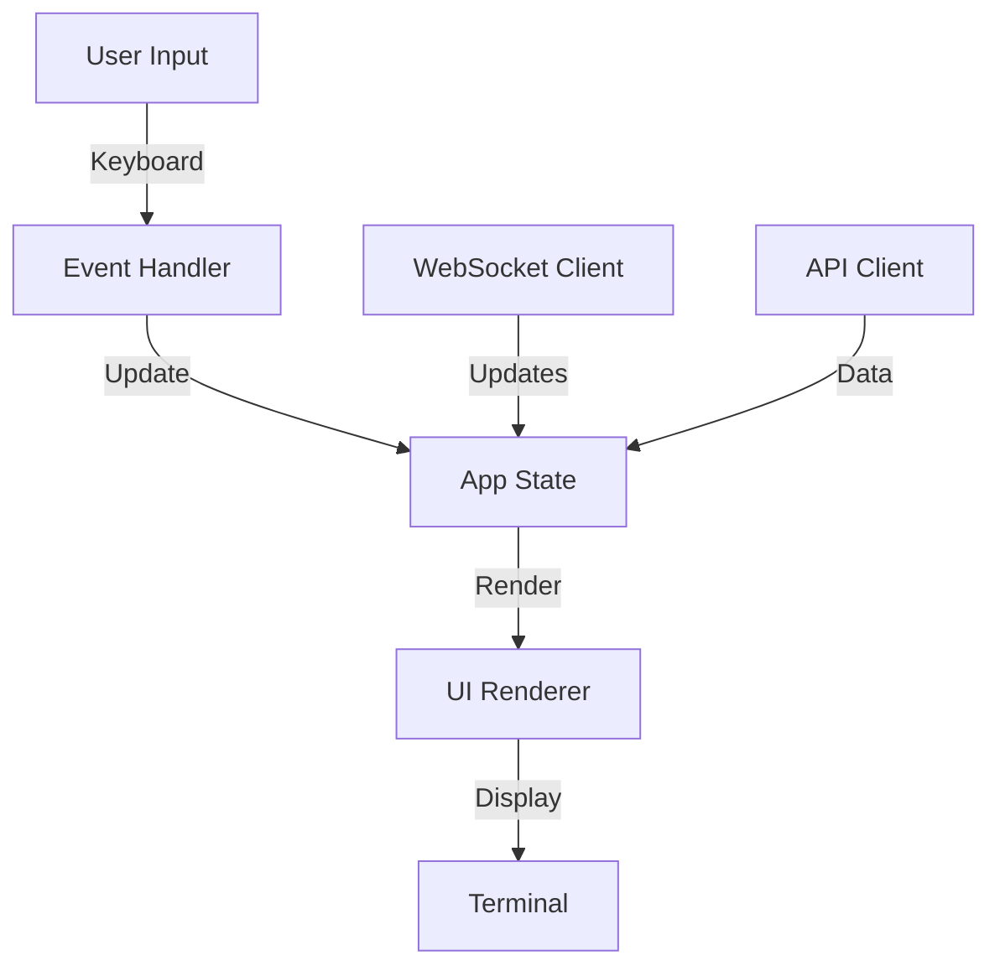

# TUI Component

The Terminal User Interface provides a real-time dashboard for monitoring and managing the CI system.

## Overview

The TUI component provides:
- Real-time dashboard with 4 tabs (Jobs, Agents, Config, Logs)
- Interactive controls and popups
- Keyboard-driven navigation
- Live updates via WebSocket
- Mock data for development and testing

## Architecture



## Status

**Current Status**: Implemented (WS-01 Complete)

The TUI is fully functional with all core features. See [WS-01 Completion Summary](../../workstreams/COMPLETION_SUMMARY.md).

## Features

### Dashboard Tabs

#### 1. Jobs Tab
- List all jobs with status (running, pending, success, failed)
- Filter by status and repository
- View job details in popup
- Real-time status updates

#### 2. Agents Tab
- List all agents with status (idle, busy, starting)
- View CPU/memory usage per agent
- Monitor agent uptime
- Restart agents

#### 3. Config Tab
- View current configuration
- Show config sources (file, env, defaults)
- Validate configuration
- Edit config path

#### 4. Logs Tab
- Stream real-time logs
- Filter by component and level
- Search log output
- Auto-scroll option

### Keyboard Shortcuts

#### Navigation
- `Tab` / `Shift+Tab` - Navigate between tabs
- `1-4` - Jump directly to tab
- `↑/↓` or `j/k` - Navigate list items
- `Enter` - View details

#### Actions
- `f` - Open filter menu
- `/` - Search mode
- `r` - Refresh data
- `?` - Show help screen
- `q` or `Ctrl+C` - Quit

### Interactive Controls

- **Confirmation dialogs** - For destructive actions
- **Filter popups** - Quick filtering
- **Search mode** - Real-time search
- **Detail views** - Full-screen item details
- **Help screen** - Keyboard shortcuts reference

## Technology Stack

- **Framework**: Ratatui (TUI framework)
- **Terminal**: crossterm (terminal manipulation)
- **Async Runtime**: tokio
- **WebSocket**: tokio-tungstenite
- **HTTP Client**: reqwest
- **State Management**: Custom app state

## Configuration

```yaml
tui:
  refresh_interval_ms: 1000
  panel_proportions: [70, 15, 15]  # [main, header, footer]
  colors:
    primary: "cyan"
    secondary: "green"
    error: "red"
    warning: "yellow"
```

## Development

### Project Structure
```
tui/
├── src/
│   ├── app.rs           # Application state
│   ├── ui.rs            # UI rendering
│   ├── events.rs        # Event handling
│   ├── widgets/
│   │   ├── jobs.rs      # Jobs tab
│   │   ├── agents.rs    # Agents tab
│   │   ├── config.rs    # Config tab
│   │   ├── logs.rs      # Logs tab
│   │   ├── popup.rs     # Popup dialogs
│   │   └── help.rs      # Help screen
│   ├── mock_data.rs     # Mock data generator
│   └── lib.rs
└── Cargo.toml
```

### Building
```bash
# Build TUI
cargo build --package tui

# Run tests
cargo test --package tui

# Run TUI
cargo run --package tui
```

### Testing

#### Unit Tests
```bash
# Test UI components
cargo test --package tui --lib

# Test state management
cargo test --package tui test_app_state
```

#### Manual Testing
```bash
# Run with debug logging
RUST_LOG=debug cargo run --package tui

# Run with mock data
cargo run --package tui -- --mock
```

### Widget Catalog

#### List Widget
Displays scrollable lists with selection:
- Jobs list
- Agents list
- Log lines

#### Table Widget
Tabular data with columns:
- Job table (ID, Status, Repo, Duration)
- Agent table (ID, Status, CPU, Memory)

#### Text Widget
Formatted text display:
- Config viewer
- Log viewer
- Help screen

#### Popup Widget
Modal dialogs:
- Confirmation dialogs
- Filter menus
- Detail views

## UI Layout

```
┌─────────────────────────────────────────────────────────┐
│ raibid-ci Dashboard              [Connected] [Jobs: 5]  │
├─────────────────────────────────────────────────────────┤
│ [Jobs] [Agents] [Config] [Logs]                         │
├─────────────────────────────────────────────────────────┤
│                                                          │
│  ┌─────────────────────────────────────────────────┐   │
│  │ ID     Status    Repo           Duration        │   │
│  ├─────────────────────────────────────────────────┤   │
│  │ job-1  Running   raibid/core    00:05:23       │   │
│  │ job-2  Pending   raibid/cli     -              │   │
│  │ job-3  Success   raibid/agent   00:03:45       │   │
│  └─────────────────────────────────────────────────┘   │
│                                                          │
├─────────────────────────────────────────────────────────┤
│ ↑/↓: Navigate | Enter: Details | f: Filter | ?: Help   │
└─────────────────────────────────────────────────────────┘
```

## Event Handling

The TUI uses an event-driven architecture:

1. **Keyboard Events** - User input
2. **WebSocket Events** - Real-time updates
3. **Timer Events** - Periodic refresh
4. **Resize Events** - Terminal size changes

Event loop:
```rust
loop {
    match event::read() {
        Event::Key(key) => handle_key(key),
        Event::WebSocket(msg) => handle_ws(msg),
        Event::Tick => refresh_data(),
        Event::Resize(w, h) => resize_ui(w, h),
    }
}
```

## State Management

### App State
```rust
pub struct App {
    pub jobs: Vec<Job>,
    pub agents: Vec<Agent>,
    pub config: Config,
    pub logs: Vec<LogEntry>,
    pub selected_tab: Tab,
    pub selected_index: usize,
    pub filter: Filter,
    pub popup: Option<Popup>,
}
```

### State Updates
- **Local updates** - UI navigation, selection
- **Remote updates** - WebSocket job/agent status
- **Periodic updates** - Refresh from API

## Related Documentation

- [User Guide](../../USER_GUIDE.md)
- [Development Guide](../../guides/tui-development.md)
- [WS-01 Workstream](../../workstreams/01-cli-tui-application/README.md)

## Mock Data

For development and testing, the TUI includes a mock data generator:

```bash
# Run with mock data
raibid-cli tui --mock

# Or set environment variable
RAIBID_TUI_MOCK=true raibid-cli tui
```

Mock data includes:
- 10 jobs with various statuses
- 5 agents with different resource usage
- Sample configuration
- Streaming log entries

---

*Last Updated: 2025-11-01*
*Status: Implemented (WS-01 Complete)*
