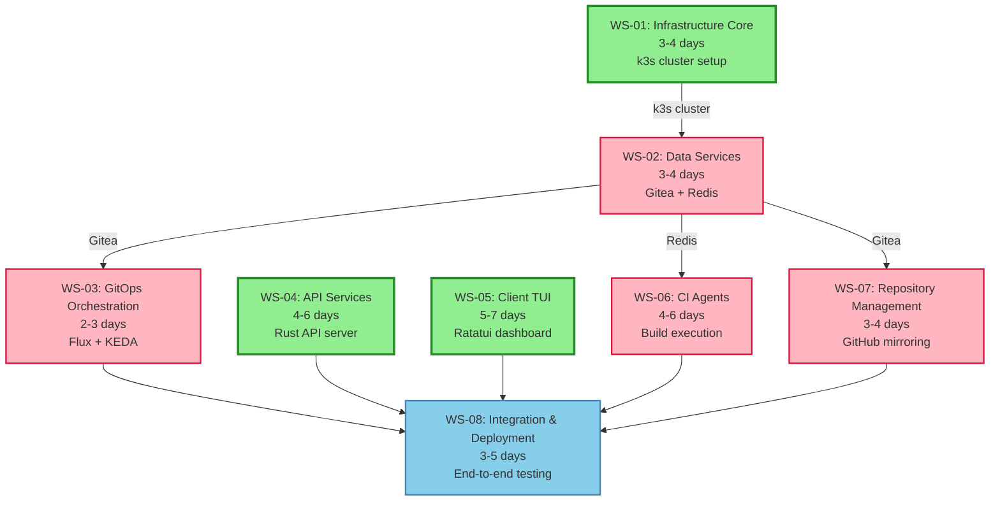

# Workstream Dependencies

This diagram shows the dependencies and parallelization opportunities across all workstreams.



## Parallelization Phases

### Phase 1: Foundation (Week 1)
**Start Immediately (Parallel):**
- ✅ WS-01: Infrastructure Core
- ✅ WS-04: API Services (development)
- ✅ WS-05: Client TUI (development)

### Phase 2: Services & Core Development (Week 2)
**After WS-01 Complete:**
- WS-02: Data Services (Gitea ∥ Redis in parallel)
- Continue: WS-04, WS-05

**After WS-02 Gitea Ready:**
- WS-03: GitOps & Orchestration
- WS-07: Repository Management (strategy design can start earlier)

### Phase 3: Agents & Integration (Week 3)
**After WS-02 Redis Ready:**
- WS-06: CI Agents

**Parallel:**
- WS-03, WS-04, WS-05, WS-06, WS-07 all running concurrently

### Phase 4: Final Integration (Week 4)
**After All Workstreams Complete:**
- WS-08: Integration & Deployment (sequential)

## Critical Path

The longest dependency chain:
```
WS-01 (k3s, 3-4d) →
  WS-02 (Gitea, 1.5d) →
    WS-03 (Flux+KEDA, 2-3d) →
      WS-06 (Agents, 4-6d) →
        WS-08 (Integration, 3-5d)
```

**Critical Path Duration:** ~14-19 days (minimum with perfect execution)

**Estimated Total Duration:** 21-31 days (accounting for parallelization and realistic execution)

## Resource Allocation Strategy

### 6-Agent Swarm Allocation

**Infrastructure Specialists (2 agents):**
- Agent 1: WS-01 → WS-02 (Gitea) → WS-03 → Support WS-08
- Agent 2: WS-02 (Redis) → Support WS-06 → Support WS-08

**Backend Developers (2 agents):**
- Agent 3: WS-04 (API Services) → Support WS-06 → Support WS-08
- Agent 4: WS-06 (CI Agents) → Support WS-08

**Client Developer (1 agent):**
- Agent 5: WS-05 (Client TUI) → Support WS-08

**DevOps Engineer (1 agent):**
- Agent 6: WS-07 (Repository Management) → WS-08 (Lead Integration)

## Issue Count by Workstream

| Workstream | Issues | Est. Duration |
|-----------|--------|---------------|
| WS-01 | 6 issues | 3-4 days |
| WS-02 | 7 issues | 3-4 days |
| WS-03 | 7 issues | 2-3 days |
| WS-04 | 8 issues | 4-6 days |
| WS-05 | 8 issues | 5-7 days |
| WS-06 | 7 issues | 4-6 days |
| WS-07 | 7 issues | 3-4 days |
| WS-08 | 9 issues | 3-5 days |
| **Total** | **59 issues** | **27-39 days** |

With parallelization: **21-31 days**

## Color Legend

- 🟢 **Green** - Can start immediately (no blockers)
- 🔴 **Pink** - Blocked initially (has dependencies)
- 🔵 **Blue** - Final integration phase (all dependencies required)
