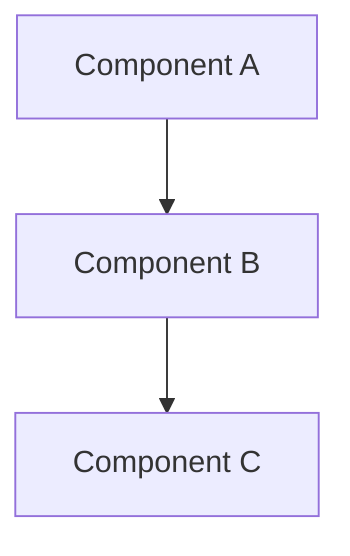

# Documentation Templates

This directory contains templates for creating consistent documentation across the raibid-ci project.

## Available Templates

### [Component README](./component-readme.md)
Template for component documentation (`docs/components/*/README.md`).

**Use this for:**
- New component documentation
- Major feature documentation
- Subsystem documentation

**Structure:**
- Overview and features
- Architecture diagram
- Technology stack
- Configuration
- Development setup
- Usage examples
- API reference

### [Guide Template](./guide.md)
Template for tutorials and how-to guides (`docs/guides/*.md`).

**Use this for:**
- Step-by-step tutorials
- How-to guides
- Installation guides
- Configuration guides

**Structure:**
- Prerequisites
- Step-by-step instructions
- Verification steps
- Troubleshooting
- Next steps

### [API Endpoint](./api-endpoint.md)
Template for API endpoint documentation (`docs/api/*.md`).

**Use this for:**
- REST API endpoints
- WebSocket events
- Protocol documentation

**Structure:**
- Request format
- Response format
- Error responses
- Examples
- Client library examples

### [Architecture Decision Record (ADR)](./adr.md)
Template for documenting architectural decisions.

**Use this for:**
- Major architectural decisions
- Technology choices
- Design patterns
- Trade-off analysis

**Structure:**
- Context and problem
- Decision
- Rationale
- Alternatives considered
- Implications

## Usage

### Creating Component Documentation

1. Copy the component template:
   ```bash
   cp docs/templates/component-readme.md docs/components/new-component/README.md
   ```

2. Fill in the template sections:
   - Replace `[Component Name]` with actual component name
   - Update architecture diagram
   - Document features and configuration
   - Add usage examples

3. Link from parent README:
   ```markdown
   - [New Component](./new-component/README.md) - Brief description
   ```

### Creating a Guide

1. Copy the guide template:
   ```bash
   cp docs/templates/guide.md docs/guides/new-guide.md
   ```

2. Fill in the sections:
   - Clear prerequisites
   - Step-by-step instructions with commands
   - Verification steps
   - Troubleshooting section

3. Link from guides README:
   ```markdown
   - [New Guide](./new-guide.md) - What this guide covers
   ```

### Documenting an API Endpoint

1. Copy the API template:
   ```bash
   cp docs/templates/api-endpoint.md docs/api/new-endpoint.md
   ```

2. Document the endpoint:
   - HTTP method and path
   - Request/response formats
   - Error responses
   - Working examples

3. Link from API README:
   ```markdown
   - `[METHOD] /api/v1/endpoint` - [Documentation](./new-endpoint.md)
   ```

### Creating an ADR

1. Determine the next ADR number:
   ```bash
   ls docs/architecture/adr/ | tail -1
   ```

2. Copy the ADR template:
   ```bash
   cp docs/templates/adr.md docs/architecture/adr/0042-decision-title.md
   ```

3. Fill in the ADR:
   - Context and problem statement
   - Decision and rationale
   - Alternatives considered
   - Implementation plan

4. Link from architecture README

## Documentation Standards

### Markdown Conventions

#### Headers
```markdown
# H1 - Document title (only one per file)
## H2 - Major sections
### H3 - Subsections
#### H4 - Sub-subsections (use sparingly)
```

#### Code Blocks
Always specify the language:
````markdown
```rust
fn main() {
    println!("Hello, world!");
}
```

```bash
# Comment explaining command
cargo build --release
```

```yaml
config:
  option: value
```
````

#### Links
Use descriptive link text:
```markdown
<!-- Good -->
See [Installation Guide](./guides/installation.md) for details.

<!-- Bad -->
Click [here](./guides/installation.md).
```

#### Lists
Use consistent formatting:
```markdown
- Item 1
- Item 2
  - Nested item
  - Another nested item
- Item 3

1. First step
2. Second step
3. Third step
```

#### Tables
Align columns for readability:
```markdown
| Column 1 | Column 2 | Column 3 |
|----------|----------|----------|
| Value 1  | Value 2  | Value 3  |
| Value 4  | Value 5  | Value 6  |
```

#### Admonitions
Use blockquotes for important notes:
```markdown
> **Note:** This is an important note.

> **Warning:** This is a warning.

> **Tip:** This is a helpful tip.
```

### Mermaid Diagrams

Use Mermaid for all diagrams:



**Diagram Types:**
- `graph TB` - Top-to-bottom flowchart
- `graph LR` - Left-to-right flowchart
- `sequenceDiagram` - Sequence diagrams
- `classDiagram` - Class diagrams
- `stateDiagram-v2` - State machines

### Writing Style

#### Voice
- **Active voice**: "The agent processes jobs" not "Jobs are processed by the agent"
- **Present tense**: "The system runs" not "The system will run"
- **Imperative for instructions**: "Install k3s" not "You should install k3s"

#### Clarity
- **Short sentences**: Aim for 15-20 words
- **Simple words**: "use" not "utilize"
- **Avoid jargon**: Explain technical terms on first use

#### Consistency
- **Terminology**: Use consistent terms (agent not worker, job not task)
- **Formatting**: Consistent code block formatting
- **Structure**: Follow template structure

### Examples

Always include working examples:

```markdown
### Example: Submit a Job

```bash
# Submit a Rust build job
raibid-cli job submit \
  --repo raibid/core \
  --branch main \
  --pipeline .raibid.yaml

# Expected output:
# Job submitted: job-abc123
# Status: pending
```
```

## Template Maintenance

### Updating Templates

When updating templates:
1. Update the template file
2. Update this README if structure changes
3. Consider migrating existing docs to new format
4. Announce changes in development chat

### Template Checklist

Before using a template, verify:
- [ ] All placeholder text replaced
- [ ] Links point to correct locations
- [ ] Code examples are tested and working
- [ ] Diagrams render correctly
- [ ] Markdown lints without errors

## Related Documentation

- [Documentation Standards](../README.md#documentation-standards)
- [Contributing Guide](../guides/contributing.md)
- [Style Guide](../guides/style-guide.md)

---

*Last Updated: 2025-11-01*
