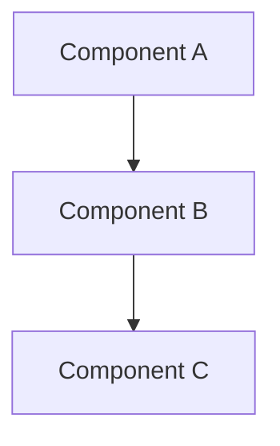

# [Component Name] Component

Brief description of what this component does (1-2 sentences).

## Overview

The [component name] component provides:
- Feature 1
- Feature 2
- Feature 3

## Architecture



## Status

**Current Status**: [Planning Phase | In Development | Implemented | Deprecated]

[Brief status description and related workstreams/issues]

## Features

### Feature 1
Description of feature 1.

**Key capabilities:**
- Capability A
- Capability B
- Capability C

### Feature 2
Description of feature 2.

## Technology Stack

- **Framework/Language**: Name and version
- **Dependencies**: Key dependencies
- **Tools**: Build tools, testing tools

## Configuration

```yaml
component:
  option1: value1
  option2: value2
  nested:
    option3: value3
```

**Configuration options:**
- `option1` - Description of option1
- `option2` - Description of option2
- `nested.option3` - Description of nested option

## Development

### Project Structure
```
component-name/
├── src/
│   ├── module1/
│   ├── module2/
│   └── main.rs
├── tests/
└── Cargo.toml
```

### Building
```bash
# Build component
cargo build --package component-name

# Run tests
cargo test --package component-name

# Run component
cargo run --package component-name
```

### Testing
```bash
# Unit tests
cargo test --package component-name --lib

# Integration tests
cargo test --package component-name --test '*'

# Specific test
cargo test --package component-name test_name
```

## Usage Examples

### Example 1: Basic Usage
```rust
// Code example
let component = Component::new();
component.do_something()?;
```

### Example 2: Advanced Usage
```rust
// More complex example
let component = Component::builder()
    .with_option("value")
    .build()?;
```

## API Reference

See [API Documentation](../../api/component-api.md) for complete reference.

## Performance

### Metrics
- Metric 1: Expected value
- Metric 2: Expected value

### Resource Usage
- CPU: X cores
- Memory: Y GB
- Disk: Z GB

## Error Handling

### Common Errors
- `ErrorType1` - Description and recovery
- `ErrorType2` - Description and recovery

### Troubleshooting
See [Troubleshooting Guide](../../guides/troubleshooting.md#component-name)

## Related Documentation

- [Architecture Overview](../../architecture/system-overview.md)
- [Development Guide](../../guides/component-development.md)
- [Workstream](../../workstreams/XX-workstream-name/README.md)

## Coming Soon / Future Work

- [ ] Feature A
- [ ] Feature B
- [ ] Enhancement C

---

*Last Updated: YYYY-MM-DD*
*Status: [Current Status]*
