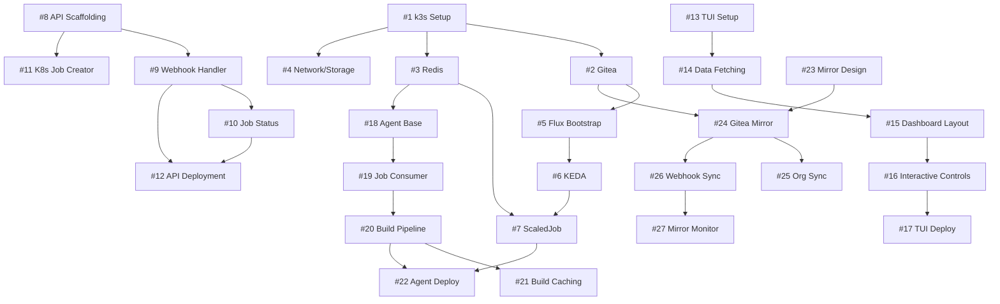

# raibid-ci Project Plan - DGX Spark CI Agent Pool

## Table of Contents

1. [Project Overview](#project-overview)
2. [Milestones](#milestones)
3. [M1: Infrastructure Bootstrap](#m1-infrastructure-bootstrap)
4. [M2: GitOps & Autoscaling](#m2-gitops--autoscaling)
5. [M3: Rust API & Job Orchestration](#m3-rust-api--job-orchestration)
6. [M4: TUI Client & Management](#m4-tui-client--management)
7. [M5: Rust CI Agent](#m5-rust-ci-agent)
8. [M6: Repository Mirroring](#m6-repository-mirroring)
9. [Dependencies & Critical Path](#dependencies--critical-path)
10. [Resource Requirements](#resource-requirements)

---

## Project Overview

**Goal:** Build a self-hosted, TUI-first, ephemeral CI agent pool for DGX Spark that maximizes utilization through auto-scaling and efficient resource management.

**Target Platform:**
- NVIDIA DGX Spark
- 20 CPU cores (10x Cortex-X925, 10x Cortex-A725)
- 128GB RAM (112GB available)
- 4TB NVMe storage
- Ubuntu 22.04 LTS

**Tech Stack:**
- Infrastructure: k3s, Gitea, Redis Streams
- GitOps: Flux CD, KEDA
- Implementation: Rust, Ratatui, Nushell
- Reference: [technology-research.md](../technology-research.md)

**Success Criteria:**
- [ ] Zero-to-N auto-scaling functional
- [ ] Rust builds complete with caching
- [ ] TUI provides real-time monitoring
- [ ] Repository mirroring operational
- [ ] Sub-60s cold start for new agents

---

## Milestones

| ID | Milestone | Duration | Completion Criteria |
|----|-----------|----------|---------------------|
| M1 | Infrastructure Bootstrap | 3-5 days | k3s running, Gitea accessible, Redis operational |
| M2 | GitOps & Autoscaling | 2-3 days | Flux syncing, KEDA scaling from queue |
| M3 | Rust API & Job Orchestration | 4-6 days | API handling webhooks, Redis job dispatch |
| M4 | TUI Client & Management | 5-7 days | Real-time dashboard, cluster control |
| M5 | Rust CI Agent | 4-6 days | Agent building/testing Rust projects |
| M6 | Repository Mirroring | 3-4 days | GitHub→Gitea sync with filtering |

**Total Estimated Duration:** 21-31 days (single developer)

---

## M1: Infrastructure Bootstrap

**Objective:** Establish core infrastructure layer on DGX Spark

### Issues

#### Issue #1: k3s Cluster Setup
**Priority:** Critical | **Complexity:** Small | **Depends On:** None

**Description:**
Install and configure k3s on DGX Spark with ARM64-optimized settings.

**Tasks:**
- [ ] Verify DGX Spark system requirements (20 cores, 128GB RAM, 4TB storage)
- [ ] Download k3s ARM64 binary from https://get.k3s.io
- [ ] Install k3s with disabled components: `--disable traefik`
- [ ] Configure kubeconfig at `/etc/rancher/k3s/k3s.yaml`
- [ ] Verify cluster health: `kubectl get nodes`
- [ ] Set up namespace structure: `ci`, `infrastructure`, `monitoring`
- [ ] Configure resource reservations (8 cores, 16GB for system)

**Success Criteria:**
- k3s cluster shows Ready status
- kubectl commands execute without errors
- Namespaces created successfully

**Reference:** [k3s docs](../technology-research.md#1-k3s---lightweight-kubernetes-distribution)

---

#### Issue #2: Gitea Deployment
**Priority:** Critical | **Complexity:** Medium | **Depends On:** #1

**Description:**
Deploy Gitea with OCI registry enabled for Git hosting and container storage.

**Tasks:**
- [ ] Create Gitea namespace: `kubectl create namespace infrastructure`
- [ ] Configure PostgreSQL StatefulSet for Gitea database
- [ ] Create PVC for Gitea data (100GB minimum)
- [ ] Deploy Gitea using Helm chart or manifests
- [ ] Enable OCI registry in `app.ini`: `[packages] ENABLED = true`
- [ ] Configure ingress/service (port 3000 HTTP, 2222 SSH)
- [ ] Create admin user and test repository
- [ ] Test container push/pull to registry
- [ ] Configure registry mirror for Docker Hub (bandwidth optimization)

**Success Criteria:**
- Gitea accessible via browser
- Git push/pull operations work
- Docker image push to `gitea.dgx.local/test/image:latest` succeeds
- OCI registry endpoint reachable

**Reference:** [Gitea docs](../technology-research.md#2-gitea---self-hosted-git-service)

---

#### Issue #3: Redis Streams Setup
**Priority:** Critical | **Complexity:** Small | **Depends On:** #1

**Description:**
Deploy Redis with Streams enabled and persistence configured for job queueing.

**Tasks:**
- [ ] Deploy Redis using Bitnami Helm chart
- [ ] Configure AOF persistence: `appendonly yes, appendfsync everysec`
- [ ] Enable RDB snapshots: `save 300 10`
- [ ] Create PVC for Redis data (10GB)
- [ ] Expose Redis service (port 6379)
- [ ] Create initial consumer group: `XGROUP CREATE ci-jobs ci-workers 0 MKSTREAM`
- [ ] Test stream operations: `XADD`, `XREADGROUP`, `XACK`
- [ ] Configure maxmemory policy: `noeviction`

**Success Criteria:**
- Redis pod running and healthy
- Stream creation/consumption functional
- Persistence working after pod restart
- Consumer group visible via `XINFO GROUPS ci-jobs`

**Reference:** [Redis Streams docs](../technology-research.md#5-redis-streams---job-queue)

---

#### Issue #4: Network & Storage Configuration
**Priority:** High | **Complexity:** Small | **Depends On:** #1

**Description:**
Configure k3s networking, storage classes, and registry integration.

**Tasks:**
- [ ] Set up local-path storage provisioner (k3s default)
- [ ] Test PVC creation and pod mounting
- [ ] Configure k3s registry integration via `/etc/rancher/k3s/registries.yaml`
- [ ] Add Gitea registry as trusted (skip TLS verification for local)
- [ ] Set up CoreDNS custom entries for `gitea.dgx.local`, `redis.dgx.local`
- [ ] Configure Flannel CNI (verify VXLAN port 8472/UDP)
- [ ] Test cross-pod communication

**Success Criteria:**
- PVCs provision successfully
- k3s can pull from Gitea registry
- DNS resolution works for custom domains
- Pod-to-pod networking functional

**Reference:** [k3s registries config](../technology-research.md#integration-points-3)

---

### M1 Deliverables

- [ ] k3s cluster operational
- [ ] Gitea accessible with OCI registry
- [ ] Redis Streams functional
- [ ] Storage/networking configured
- [ ] Documentation: installation runbook

---

## M2: GitOps & Autoscaling

**Objective:** Enable GitOps automation and event-driven autoscaling

### Issues

#### Issue #5: Flux CD Bootstrap
**Priority:** Critical | **Complexity:** Medium | **Depends On:** #2

**Description:**
Bootstrap Flux CD with Gitea as Git source for declarative cluster management.

**Tasks:**
- [ ] Generate Gitea personal access token with repo permissions
- [ ] Install Flux CLI on DGX: `curl -s https://fluxcd.io/install.sh | bash`
- [ ] Bootstrap Flux: `flux bootstrap gitea --hostname=gitea.dgx.local --owner=admin --repository=flux-system`
- [ ] Verify Flux controllers running: `flux check`
- [ ] Create repository structure: `clusters/dgx-spark/{infrastructure,apps}`
- [ ] Set up Kustomization hierarchy
- [ ] Test reconciliation: `flux reconcile kustomization flux-system`
- [ ] Configure SOPS/Age for secret encryption (optional MVP extension)

**Success Criteria:**
- Flux controllers healthy
- Git commits auto-applied to cluster
- `flux get all` shows synced resources
- Gitea repository contains cluster state

**Reference:** [Flux Gitea bootstrap](../technology-research.md#gitea-integration)

---

#### Issue #6: KEDA Deployment
**Priority:** Critical | **Complexity:** Medium | **Depends On:** #5

**Description:**
Deploy KEDA via Flux for Redis Streams-based autoscaling.

**Tasks:**
- [ ] Create HelmRepository for KEDA: `kedacore/charts`
- [ ] Create HelmRelease manifest in `infrastructure/keda/`
- [ ] Configure KEDA namespace and resource limits
- [ ] Commit to Git and verify Flux applies
- [ ] Verify KEDA pods: `kubectl get pods -n keda`
- [ ] Check KEDA CRDs: `kubectl get crd | grep keda`

**Success Criteria:**
- KEDA operator and metrics server running
- CRDs installed: `scaledjobs.keda.sh`, `scaledobjects.keda.sh`
- `kubectl get scaledjobs --all-namespaces` returns no errors

**Reference:** [KEDA installation](../technology-research.md#installation-example-4)

---

#### Issue #7: ScaledJob Configuration
**Priority:** High | **Complexity:** Medium | **Depends On:** #6

**Description:**
Create ScaledJob CRD for CI agent autoscaling based on Redis queue depth.

**Tasks:**
- [ ] Create ScaledJob manifest: `infrastructure/keda/ci-agent-scaledjob.yaml`
- [ ] Configure Redis Streams trigger:
  ```yaml
  triggers:
  - type: redis-streams
    metadata:
      address: redis.infrastructure.svc:6379
      stream: ci-jobs
      consumerGroup: ci-workers
      pendingEntriesCount: "1"
  ```
- [ ] Set scaling parameters: `minReplicaCount: 0`, `maxReplicaCount: 10`
- [ ] Configure Job template (placeholder container for testing)
- [ ] Set polling interval: `pollingInterval: 10`
- [ ] Commit and apply via Flux
- [ ] Test scaling: `XADD ci-jobs * test job`, verify pod creation

**Success Criteria:**
- ScaledJob resource created
- Adding messages to Redis spawns pods
- Pods terminate after processing
- Scaling to zero after queue empty

**Reference:** [KEDA Redis Streams scaler](../technology-research.md#redis-streams-integration)

---

### M2 Deliverables

- [ ] Flux CD managing cluster state
- [ ] KEDA autoscaling functional
- [ ] ScaledJob responds to Redis queue
- [ ] Documentation: GitOps workflow guide

---

## M3: Rust API & Job Orchestration

**Objective:** Build server-side Rust API for job dispatch and communication

### Issues

#### Issue #8: API Project Scaffolding
**Priority:** Critical | **Complexity:** Small | **Depends On:** None

**Description:**
Initialize Rust API project with dependencies and project structure.

**Tasks:**
- [ ] Create Rust workspace: `cargo new --lib raibid-api`
- [ ] Add dependencies to `Cargo.toml`:
  - `axum` (web framework)
  - `tokio` (async runtime)
  - `redis` (Redis client)
  - `serde`, `serde_json` (serialization)
  - `kube`, `k8s-openapi` (Kubernetes client)
  - `tracing`, `tracing-subscriber` (logging)
- [ ] Set up module structure: `api/`, `jobs/`, `webhook/`, `config/`
- [ ] Configure cross-compilation for ARM64
- [ ] Create Dockerfile with multi-stage build

**Success Criteria:**
- `cargo build` succeeds
- Project compiles for ARM64
- Dependencies resolve correctly

**Reference:** [kube-rs docs](../technology-research.md#81-kube-rs---rust-kubernetes-client)

---

#### Issue #9: Webhook Handler Implementation
**Priority:** High | **Complexity:** Medium | **Depends On:** #8

**Description:**
Implement Gitea webhook receiver to capture push events and enqueue jobs.

**Tasks:**
- [ ] Create Axum route: `POST /webhook/gitea`
- [ ] Parse Gitea webhook payload (JSON)
- [ ] Extract: repository, branch, commit SHA, author
- [ ] Validate webhook signature (HMAC secret)
- [ ] Generate unique job ID (UUID)
- [ ] Push job to Redis Streams: `XADD ci-jobs * job_id <uuid> repo <repo> ...`
- [ ] Return 200 OK with job ID
- [ ] Add error handling and logging
- [ ] Write unit tests

**Success Criteria:**
- Webhook endpoint accepts POST requests
- Jobs appear in Redis stream
- Invalid signatures rejected
- Logs show job creation events

**Reference:** [Gitea webhooks](https://docs.gitea.com/usage/webhooks)

---

#### Issue #10: Job Status Tracker
**Priority:** Medium | **Complexity:** Medium | **Depends On:** #9

**Description:**
Implement job status tracking using Redis hashes for real-time monitoring.

**Tasks:**
- [ ] Create Redis hash structure: `job:<job_id>` with fields `status`, `started_at`, `finished_at`, `agent`, `logs`
- [ ] Update status on job state changes: `pending`, `running`, `success`, `failed`
- [ ] Implement TTL for completed jobs (24 hours)
- [ ] Create API endpoint: `GET /jobs/:id` to fetch status
- [ ] Create list endpoint: `GET /jobs` with filtering (status, repo)
- [ ] Add pagination support
- [ ] Implement log streaming via Server-Sent Events (SSE)

**Success Criteria:**
- Job status persists in Redis
- API returns current job state
- Completed jobs expire after TTL
- SSE streams logs in real-time

---

#### Issue #11: Kubernetes Job Creator
**Priority:** Medium | **Complexity:** Large | **Depends On:** #8

**Description:**
Integrate kube-rs to create/manage Kubernetes Jobs for CI agents (alternative to KEDA for manual control).

**Tasks:**
- [ ] Initialize kube client: `Client::try_default()`
- [ ] Create Job template in code (mirrors ScaledJob template)
- [ ] Set resource limits: 2 CPU, 4GB RAM per agent
- [ ] Mount volumes: Docker socket (if using Docker-in-Docker)
- [ ] Set environment variables: `REDIS_URL`, `JOB_ID`, `REPO`, `COMMIT`
- [ ] Apply Job via API: `jobs.create(&PostParams::default(), &job_spec)`
- [ ] Watch Job status and update Redis
- [ ] Implement cleanup: delete completed Jobs after N minutes
- [ ] Add retry logic for failed Jobs

**Success Criteria:**
- API creates Jobs on demand
- Jobs appear in `kubectl get jobs -n ci`
- Job status synced to Redis
- Cleanup removes old Jobs

**Note:** This issue may be deferred if KEDA ScaledJob (Issue #7) handles Job creation adequately. Useful for advanced scheduling logic.

**Reference:** [kube-rs examples](https://github.com/kube-rs/kube/tree/main/examples)

---

#### Issue #12: API Deployment
**Priority:** High | **Complexity:** Medium | **Depends On:** #9, #10

**Description:**
Deploy Rust API to k3s cluster via Flux CD.

**Tasks:**
- [ ] Build Docker image: `docker buildx build --platform linux/arm64`
- [ ] Push to Gitea registry: `gitea.dgx.local/raibid/api:v0.1`
- [ ] Create Kubernetes Deployment manifest: `apps/raibid-api/deployment.yaml`
- [ ] Configure Service: ClusterIP or LoadBalancer
- [ ] Set environment variables: `REDIS_URL=redis://redis.infrastructure.svc:6379`
- [ ] Add ConfigMap for configuration
- [ ] Commit to flux-system repo
- [ ] Verify deployment via Flux: `flux reconcile kustomization apps`
- [ ] Test webhook endpoint from outside cluster

**Success Criteria:**
- API pod running in `ci` namespace
- Webhook endpoint reachable
- Logs show successful startup
- Job creation functional

---

### M3 Deliverables

- [ ] Rust API deployed and operational
- [ ] Webhooks triggering job creation
- [ ] Job status tracking functional
- [ ] API documentation (OpenAPI spec)

---

## M4: TUI Client & Management

**Objective:** Build Ratatui-based TUI for monitoring and control

### Issues

#### Issue #13: TUI Project Setup
**Priority:** High | **Complexity:** Small | **Depends On:** None

**Description:**
Initialize Ratatui TUI project with core dependencies.

**Tasks:**
- [ ] Create Rust project: `cargo new raibid-tui`
- [ ] Add dependencies:
  - `ratatui` (TUI framework)
  - `crossterm` (terminal backend)
  - `tokio` (async runtime)
  - `kube`, `k8s-openapi` (Kubernetes client)
  - `redis` (Redis client)
  - `serde`, `serde_json`
  - `chrono` (timestamps)
- [ ] Set up app state structure
- [ ] Implement event loop with `crossterm::event`
- [ ] Create basic terminal initialization/cleanup
- [ ] Add graceful shutdown on `q` or `Ctrl+C`

**Success Criteria:**
- TUI compiles and runs
- Terminal restores properly on exit
- Keyboard events processed

**Reference:** [Ratatui examples](../technology-research.md#architecture-and-best-practices-1)

---

#### Issue #14: Real-time Data Fetching
**Priority:** High | **Complexity:** Medium | **Depends On:** #13

**Description:**
Implement async data fetching from k3s and Redis for dashboard updates.

**Tasks:**
- [ ] Create background task for data fetching (Tokio task)
- [ ] Fetch CI jobs from Redis: `XRANGE ci-jobs - +`
- [ ] Fetch pod list via kube-rs: `Api<Pod>::list()`
- [ ] Fetch ScaledJob status via KEDA CRD
- [ ] Query job status from Redis hashes
- [ ] Use `tokio::sync::mpsc` channel to send data to UI thread
- [ ] Implement 1-second refresh rate
- [ ] Add error handling for connection failures

**Success Criteria:**
- Data updates every second
- UI shows current jobs/pods
- No UI blocking during fetch
- Connection errors displayed gracefully

**Reference:** [Ratatui async pattern](../technology-research.md#integration-with-k3skeda)

---

#### Issue #15: Dashboard Layout
**Priority:** High | **Complexity:** Medium | **Depends On:** #14

**Description:**
Design and implement multi-panel TUI layout with tables, graphs, and logs.

**Tasks:**
- [ ] Create layout with 3 sections: Jobs (top 50%), Agents (bottom-left 25%), Queue (bottom-right 25%)
- [ ] Implement Jobs table widget:
  - Columns: Job ID, Status, Repo, Branch, Duration, Agent
  - Color coding: green (success), yellow (running), red (failed)
- [ ] Implement Agents list widget:
  - Show active pods with status
  - Display current job assignment
- [ ] Implement Queue depth sparkline widget:
  - Rolling history (last 60 seconds)
  - Visual representation of queue size
- [ ] Add header with system info: cluster name, CPU/RAM usage
- [ ] Add footer with keybindings: `q: quit`, `r: refresh`, `Tab: switch view`

**Success Criteria:**
- Dashboard renders correctly at 80x24 and larger
- Tables show live data
- Sparkline updates in real-time
- Layout responsive to terminal resize

**Reference:** [Ratatui widgets](../technology-research.md#example-widgets-for-ci-monitoring)

---

#### Issue #16: Interactive Controls
**Priority:** Medium | **Complexity:** Medium | **Depends On:** #15

**Description:**
Add keyboard navigation and control commands to TUI.

**Tasks:**
- [ ] Implement job detail view: press `Enter` on job row to expand
- [ ] Add log streaming view: tail last 100 lines of job logs
- [ ] Implement job cancellation: `c` key to cancel selected job
- [ ] Add manual job trigger: `n` key to create new job (prompt for repo/branch)
- [ ] Implement agent scaling: `+/-` to adjust max replicas
- [ ] Add tab switching: cycle through Jobs/Agents/System views
- [ ] Implement search/filter: `/` key to filter jobs by repo or status

**Success Criteria:**
- All keybindings functional
- Job details display on demand
- Logs stream in real-time
- Scaling commands update KEDA resources

---

#### Issue #17: TUI Deployment
**Priority:** Medium | **Complexity:** Small | **Depends On:** #16

**Description:**
Package TUI as standalone binary and distribute for DGX Spark.

**Tasks:**
- [ ] Build release binary: `cargo build --release --target aarch64-unknown-linux-gnu`
- [ ] Create installation script: copy to `/usr/local/bin/raibid-tui`
- [ ] Add shell completion scripts (bash, zsh)
- [ ] Create systemd service for background monitoring (optional)
- [ ] Write user documentation: keybindings, usage guide
- [ ] Test on DGX Spark over SSH
- [ ] Optimize binary size with `strip` and LTO

**Success Criteria:**
- Binary runs on DGX Spark
- Installation via single script
- Documentation clear and complete

---

### M4 Deliverables

- [ ] Ratatui TUI fully functional
- [ ] Real-time monitoring of jobs/agents
- [ ] Interactive job management
- [ ] User guide and keybindings reference

---

## M5: Rust CI Agent

**Objective:** Implement ephemeral CI agent for Rust project builds

### Issues

#### Issue #18: Agent Container Base
**Priority:** Critical | **Complexity:** Medium | **Depends On:** #3

**Description:**
Create Docker container image for CI agent with Rust toolchain and dependencies.

**Tasks:**
- [ ] Create Dockerfile based on `rust:1.82-bookworm` (ARM64)
- [ ] Install system dependencies: git, ssh, ca-certificates
- [ ] Configure Rust toolchain: stable, ARM64 targets
- [ ] Add Docker CLI for building images (Docker-in-Docker or Docker socket mount)
- [ ] Install cargo tools: `cargo-nextest`, `cargo-audit`, `cargo-deny`
- [ ] Configure credential helpers for Gitea
- [ ] Add healthcheck script
- [ ] Optimize image size: multi-stage build, layer caching
- [ ] Test build on DGX Spark

**Success Criteria:**
- Image builds successfully for ARM64
- Size < 2GB
- `cargo --version` works in container
- Git clone functional

**Reference:** [Docker multi-platform builds](../technology-research.md#83-build-caching-strategies)

---

#### Issue #19: Job Consumer Implementation
**Priority:** Critical | **Complexity:** Medium | **Depends On:** #18

**Description:**
Implement Rust agent logic to consume jobs from Redis Streams.

**Tasks:**
- [ ] Connect to Redis: `redis::Client::open(REDIS_URL)`
- [ ] Join consumer group: `XGROUP CREATE ci-jobs ci-workers $ MKSTREAM`
- [ ] Implement consume loop:
  ```rust
  XREADGROUP GROUP ci-workers $HOSTNAME COUNT 1 BLOCK 5000 STREAMS ci-jobs >
  ```
- [ ] Parse job message: extract `repo`, `branch`, `commit`, `job_id`
- [ ] Update job status in Redis hash: `HSET job:<id> status running`
- [ ] Clone repository via HTTPS with credentials
- [ ] Acknowledge message on success: `XACK ci-jobs ci-workers <msg_id>`
- [ ] Handle errors: log and move to dead-letter queue
- [ ] Implement graceful shutdown (SIGTERM)

**Success Criteria:**
- Agent consumes messages from Redis
- Job status updates in real-time
- Failed jobs requeue correctly
- Agent terminates cleanly

**Reference:** [Redis Streams consumer pattern](../technology-research.md#redis-streams--keda-integration)

---

#### Issue #20: Rust Build Pipeline
**Priority:** High | **Complexity:** Large | **Depends On:** #19

**Description:**
Implement full Rust build, test, and publish pipeline in agent.

**Tasks:**
- [ ] Run `cargo check` to validate code
- [ ] Execute `cargo build --release` with target caching
- [ ] Run tests: `cargo nextest run` or `cargo test`
- [ ] Capture test output and store in Redis (logs field)
- [ ] Run linting: `cargo clippy -- -D warnings`
- [ ] Run security audit: `cargo audit`
- [ ] Build Docker image if Dockerfile present:
  ```bash
  docker buildx build --platform linux/arm64 -t gitea.dgx.local/$REPO:$COMMIT .
  ```
- [ ] Push image to Gitea registry
- [ ] Update job status: `success` or `failed`
- [ ] Store build artifacts metadata in Redis
- [ ] Implement build timeout (30 min default)

**Success Criteria:**
- Complete builds succeed
- Tests execute and report results
- Docker images pushed to registry
- Build logs available via API

**Reference:** [Cargo build optimization](https://doc.rust-lang.org/cargo/guide/build-cache.html)

---

#### Issue #21: Build Caching Strategy
**Priority:** High | **Complexity:** Medium | **Depends On:** #20

**Description:**
Implement persistent caching for Cargo and Docker layers to speed up builds.

**Tasks:**
- [ ] Mount persistent volume for Cargo cache: `/usr/local/cargo/registry`
- [ ] Configure Docker BuildKit cache backend: `--cache-from type=registry`
- [ ] Use per-architecture cache refs: `buildcache-arm64`, `buildcache-amd64`
- [ ] Enable `mode=max` for full layer caching
- [ ] Implement cache pruning: delete caches older than 7 days
- [ ] Monitor cache hit rate via metrics
- [ ] Configure sccache for Rust compilation caching (optional)
- [ ] Test cache effectiveness: measure build time delta

**Success Criteria:**
- Cache hit rate > 70% for repeat builds
- Build time reduced by 2-5x with warm cache
- Cache storage < 50GB per agent
- Metrics show cache usage

**Reference:** [Docker BuildKit caching](../technology-research.md#docker-buildx-with-buildkit)

---

#### Issue #22: Agent Deployment
**Priority:** High | **Complexity:** Small | **Depends On:** #20

**Description:**
Deploy CI agent image and update ScaledJob to use it.

**Tasks:**
- [ ] Build final agent image: `raibid/ci-agent:v0.1`
- [ ] Push to Gitea registry
- [ ] Update ScaledJob template to use agent image
- [ ] Configure resource limits: 2 CPU, 4GB RAM
- [ ] Mount Docker socket or use Docker-in-Docker
- [ ] Set environment variables: `REDIS_URL`, `GITEA_URL`, `GITEA_TOKEN`
- [ ] Add PVC for build cache
- [ ] Commit to flux-system repo
- [ ] Test end-to-end: push code → webhook → build → image published

**Success Criteria:**
- Agent pods spawn on job creation
- Builds complete successfully
- Images appear in Gitea registry
- Agents scale to zero when idle

---

### M5 Deliverables

- [ ] CI agent container functional
- [ ] Rust builds complete with tests
- [ ] Build caching operational
- [ ] End-to-end CI pipeline working

---

## M6: Repository Mirroring

**Objective:** Automate GitHub to Gitea repository synchronization

### Issues

#### Issue #23: Mirroring Strategy Design
**Priority:** Medium | **Complexity:** Small | **Depends On:** None

**Description:**
Design mirroring architecture supporting single repo, multiple repos, and org-level sync.

**Tasks:**
- [ ] Define configuration schema (YAML):
  ```yaml
  mirrors:
    - type: single
      source: https://github.com/user/repo
      target: gitea.dgx.local/user/repo
    - type: org
      source: https://github.com/myorg
      include: "^rust-.*"
      exclude: ".*-archive$"
  ```
- [ ] Choose implementation: Gitea built-in mirroring vs custom sync tool
- [ ] Design sync frequency: webhook-based (instant) vs polling (5 min)
- [ ] Plan authentication: GitHub PAT, SSH keys
- [ ] Design conflict resolution: GitHub as source of truth (force push)

**Decisions:**
- Use Gitea's built-in repository mirroring for simplicity
- Configure webhooks for instant sync
- Create Nushell script for org-level setup automation

---

#### Issue #24: Gitea Mirror Configuration
**Priority:** Medium | **Complexity:** Medium | **Depends On:** #23

**Description:**
Configure Gitea repository mirroring for single and multiple repositories.

**Tasks:**
- [ ] Create Gitea API client script (Nushell or Rust)
- [ ] Implement mirror creation via API: `POST /api/v1/repos/migrate`
- [ ] Set mirror parameters:
  ```json
  {
    "clone_addr": "https://github.com/user/repo",
    "mirror": true,
    "mirror_interval": "1h",
    "repo_name": "repo",
    "repo_owner": "user",
    "service": "github"
  }
  ```
- [ ] Configure GitHub PAT for authentication
- [ ] Test single repo mirroring
- [ ] Verify sync on GitHub push
- [ ] Add error handling for failed syncs

**Success Criteria:**
- Gitea mirrors GitHub repos
- Pushes to GitHub trigger sync within 5 minutes
- Mirror status visible in Gitea UI

**Reference:** [Gitea API - Repository Migration](https://docs.gitea.com/api/1.20/#tag/repository/operation/repoMigrate)

---

#### Issue #25: Organization-Level Sync
**Priority:** Medium | **Complexity:** Large | **Depends On:** #24

**Description:**
Implement org-level mirroring with regex filtering for selective sync.

**Tasks:**
- [ ] Create Nushell script: `mirror-org.nu`
- [ ] Fetch GitHub org repositories via API: `gh repo list myorg --json name,url`
- [ ] Filter repositories with regex: `$repos | where name =~ $include_pattern`
- [ ] Exclude repositories matching exclude pattern
- [ ] Iterate and create mirrors via Gitea API
- [ ] Store mirror configuration in Git (declarative)
- [ ] Implement idempotency: skip existing mirrors
- [ ] Add dry-run mode for testing
- [ ] Schedule periodic re-scan (daily cron) for new repos

**Success Criteria:**
- Script mirrors entire org with filtering
- New repos auto-detected and mirrored
- Configuration version-controlled
- Dry-run shows planned actions

**Example:**
```nu
# mirror-org.nu
let org = "myorg"
let include = "^rust-.*"
let exclude = ".*-archive$"

gh repo list $org --json name,url
| from json
| where name =~ $include
| where name !~ $exclude
| each { |repo|
    gitea-mirror create $repo.url $repo.name
}
```

**Reference:** [Nushell GitHub integration](../technology-research.md#example-1-find-all-pending-ci-jobs)

---

#### Issue #26: Webhook-Based Sync
**Priority:** Medium | **Complexity:** Medium | **Depends On:** #24

**Description:**
Configure GitHub webhooks to trigger immediate Gitea sync on push.

**Tasks:**
- [ ] Create webhook endpoint in Rust API: `POST /webhook/github-sync`
- [ ] Register webhook in GitHub repository settings
- [ ] Validate webhook signature (HMAC)
- [ ] Extract repository name from payload
- [ ] Trigger Gitea mirror sync via API: `POST /api/v1/repos/{owner}/{repo}/mirror-sync`
- [ ] Return 200 OK to GitHub
- [ ] Log sync requests
- [ ] Handle rate limits (GitHub: 5000/hour, Gitea: unlimited)

**Success Criteria:**
- Pushes to GitHub trigger instant sync
- Webhook delivers within 5 seconds
- Gitea mirror updated within 30 seconds
- Failed syncs logged and alerted

---

#### Issue #27: Mirror Monitoring
**Priority:** Low | **Complexity:** Small | **Depends On:** #26

**Description:**
Add mirroring status to TUI dashboard and expose metrics.

**Tasks:**
- [ ] Add Mirrors tab to TUI: show all configured mirrors
- [ ] Display sync status: last sync time, next sync, errors
- [ ] Fetch mirror status via Gitea API: `GET /api/v1/repos/{owner}/{repo}`
- [ ] Highlight stale mirrors (no sync in 24 hours)
- [ ] Add manual sync trigger from TUI: `s` key
- [ ] Export Prometheus metrics: `mirror_sync_duration`, `mirror_sync_errors`

**Success Criteria:**
- TUI shows mirror health
- Manual sync works on-demand
- Metrics available for alerting

---

### M6 Deliverables

- [ ] Repository mirroring functional
- [ ] Org-level sync with filtering
- [ ] Webhook-based instant sync
- [ ] Mirror monitoring in TUI

---

## Dependencies & Critical Path

### Dependency Graph



### Critical Path (Longest Dependency Chain)

1. **#1** k3s Setup (1 day)
2. **#2** Gitea Deployment (1.5 days)
3. **#5** Flux Bootstrap (1 day)
4. **#6** KEDA Deployment (0.5 days)
5. **#7** ScaledJob Configuration (1 day)
6. **#18** Agent Base (1.5 days)
7. **#19** Job Consumer (1.5 days)
8. **#20** Build Pipeline (2.5 days)
9. **#22** Agent Deploy (0.5 days)

**Critical Path Duration:** ~11 days (minimum timeline if parallelizing non-dependent tasks)

### Parallelization Opportunities

**Week 1:**
- Parallel: #1 k3s, #8 API Scaffolding, #13 TUI Setup, #23 Mirror Design
- Sequence: #2 Gitea → #3 Redis → #4 Network

**Week 2:**
- Parallel: #5 Flux, #9 Webhook Handler, #14 TUI Data Fetching
- Sequence: #6 KEDA → #7 ScaledJob

**Week 3:**
- Parallel: #18 Agent Base, #10 Job Status, #15 Dashboard Layout, #24 Gitea Mirror
- Sequence: #19 Job Consumer → #20 Build Pipeline

**Week 4:**
- Parallel: #21 Build Caching, #16 Interactive Controls, #25 Org Sync
- Sequence: #22 Agent Deploy, #12 API Deploy

---

## Resource Requirements

### Development Environment

**Hardware:**
- DGX Spark (ARM64)
- Development machine (for cross-compilation if needed)
- Network access to GitHub, crates.io, Docker Hub

**Software:**
- Rust 1.82+ (stable)
- Docker 24+
- kubectl 1.28+
- Flux CLI 2.3+
- Nushell 0.103+
- Git 2.40+

### Cluster Resource Allocation

**Reserved for Infrastructure (always running):**
- k3s control plane: 2 cores, 2GB RAM
- Gitea: 2 cores, 4GB RAM, 100GB disk
- Redis: 1 core, 2GB RAM, 10GB disk
- Flux controllers: 0.5 cores, 512MB RAM
- KEDA: 0.5 cores, 512MB RAM
- Rust API: 0.5 cores, 512MB RAM

**Total Reserved:** ~6.5 cores, ~9.5GB RAM, ~110GB disk

**Available for CI Agents:** ~13.5 cores, ~102.5GB RAM

**Max Concurrent Agents:** 6 (at 2 cores, 4GB each) or 10 (at 1 core, 2GB each)

### Storage Breakdown

| Component | Size | Purpose |
|-----------|------|---------|
| Gitea data | 100 GB | Git repos + OCI registry |
| Redis persistence | 10 GB | Job queue + status |
| Build cache (shared) | 50 GB | Cargo registry + Docker layers |
| System/temp | 40 GB | Logs, temp files |
| **Total** | **200 GB** | NVMe SSD |

**Note:** 4TB available, 200GB needed for MVP (5% utilization). Ample room for growth.

### Network Requirements

- **Bandwidth:** 1 Gbps minimum (for image push/pull)
- **Latency:** <10ms to Gitea/Redis (same host)
- **Egress:** ~10 GB/day (pulling dependencies, pushing images)

### External Dependencies

- **crates.io:** Rust dependency registry (fallback: vendored dependencies)
- **GitHub:** Source repository mirroring
- **Docker Hub:** Base images (mirrored in Gitea for offline operation)

---

## Success Metrics

### Performance Targets

- [ ] Agent cold start: <60 seconds (pod creation to job start)
- [ ] Rust build (cached): <5 minutes for medium project
- [ ] Rust build (cold): <15 minutes for medium project
- [ ] Queue to execution latency: <10 seconds
- [ ] TUI refresh rate: 1 second
- [ ] Cache hit rate: >70%

### Reliability Targets

- [ ] Agent success rate: >95% (excluding code failures)
- [ ] KEDA scaling accuracy: <5% overshoot/undershoot
- [ ] Zero data loss in Redis (with persistence)
- [ ] Gitea uptime: >99% (single node acceptable for MVP)

### Usability Targets

- [ ] TUI usable over 2G SSH connection
- [ ] Documentation complete (installation, usage, troubleshooting)
- [ ] Setup time from bare metal: <4 hours
- [ ] Mirroring setup: <30 minutes per org

---

## Risk Mitigation

### Technical Risks

| Risk | Impact | Probability | Mitigation |
|------|--------|-------------|------------|
| ARM64 compatibility issues | High | Low | All components verified ARM64-ready; test early |
| Docker-in-Docker performance | Medium | Medium | Use Docker socket mount; benchmark both approaches |
| Cache storage exhaustion | Medium | Medium | Implement cache pruning; monitor disk usage |
| Redis memory limits | Medium | Low | Configure maxmemory policy; use persistence |
| KEDA scaling delays | Low | Medium | Tune polling interval; test under load |

### Operational Risks

| Risk | Impact | Probability | Mitigation |
|------|--------|-------------|------------|
| Single point of failure (Gitea) | High | Medium | Document backup/restore; plan HA for post-MVP |
| Network partition | High | Low | Implement offline mode; cache dependencies |
| Disk failure | High | Low | RAID or external backup; monitor SMART data |
| Certificate expiration | Low | Medium | Use Let's Encrypt automation or long-lived certs |

### Deferred Features (Post-MVP)

- High availability (multi-node k3s)
- GPU time-slicing for ML testing
- Multi-language agents (Go, Python, Node.js)
- Web UI (Tauri-based)
- Advanced caching (sccache, remote build cache)
- Integration with external CI (GitHub Actions, GitLab CI)
- Image vulnerability scanning (Trivy, Clair)

---

## Appendix

### Useful Commands Reference

**k3s:**
```bash
# Install
curl -sfL https://get.k3s.io | sh -
# Uninstall
/usr/local/bin/k3s-uninstall.sh
# Logs
journalctl -u k3s -f
```

**Flux:**
```bash
# Bootstrap
flux bootstrap gitea --hostname=gitea.dgx.local --owner=admin --repository=flux-system
# Status
flux get all
flux logs --all-namespaces
# Force reconcile
flux reconcile kustomization apps
```

**KEDA:**
```bash
# List scaled jobs
kubectl get scaledjobs -n ci
# Describe scaler
kubectl describe scaledjob ci-agent-scaler -n ci
# View metrics
kubectl get --raw /apis/external.metrics.k8s.io/v1beta1
```

**Redis:**
```bash
# Connect
redis-cli -h redis.infrastructure.svc
# Check stream
XINFO STREAM ci-jobs
# List consumer groups
XINFO GROUPS ci-jobs
# Check pending
XPENDING ci-jobs ci-workers
```

**Gitea:**
```bash
# API: Create mirror
curl -X POST https://gitea.dgx.local/api/v1/repos/migrate \
  -H "Authorization: token $GITEA_TOKEN" \
  -d '{"clone_addr": "https://github.com/user/repo", "mirror": true}'
# API: Trigger sync
curl -X POST https://gitea.dgx.local/api/v1/repos/user/repo/mirror-sync \
  -H "Authorization: token $GITEA_TOKEN"
```

### Glossary

- **DGX Spark:** NVIDIA's ARM64-based AI edge device
- **Ephemeral Agent:** Short-lived CI agent that terminates after job completion
- **GitOps:** Infrastructure management via Git as source of truth
- **KEDA:** Kubernetes Event-Driven Autoscaling
- **OCI:** Open Container Initiative (container image standard)
- **ScaledJob:** KEDA CRD for creating Jobs based on events
- **TUI:** Terminal User Interface (vs GUI)
- **Zero-to-N Scaling:** Scaling from 0 replicas to N based on demand

---

**Document Version:** 1.0
**Created:** 2025-10-28
**Author:** raibid-ci planning team
**License:** MIT
