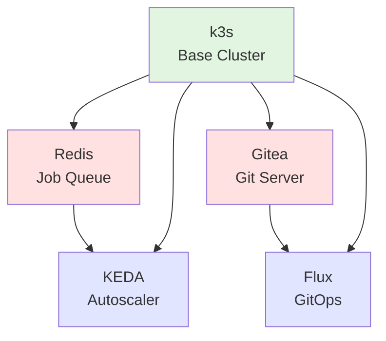

# Infrastructure Deployment Guide

This guide documents the correct deployment sequence for raibid-ci infrastructure components.

## Table of Contents

- [Prerequisites](#prerequisites)
- [Deployment Sequence](#deployment-sequence)
- [Component Dependencies](#component-dependencies)
- [Deployment Methods](#deployment-methods)
- [Validation](#validation)
- [Troubleshooting](#troubleshooting)

## Prerequisites

### System Requirements

- **OS**: Ubuntu 22.04 LTS (or compatible)
- **CPU**: 2+ cores recommended
- **Memory**: 4GB+ RAM
- **Disk**: 20GB+ available space
- **Network**: Internet connectivity for pulling images

### Required Tools

```bash
# Install curl
sudo apt-get update
sudo apt-get install -y curl

# raibid-cli will auto-install:
# - kubectl
# - helm
# - k3s
```

### Optional Tools

```bash
# For manual operations
sudo apt-get install -y python3 python3-pip

# For validation
pip3 install yamllint

# For Helm operations
curl https://raw.githubusercontent.com/helm/helm/main/scripts/get-helm-3 | bash
```

## Deployment Sequence

Infrastructure components must be deployed in the following order due to dependencies:

```
1. k3s (Foundation)
   │
   ├─→ 2a. Redis (Job Queue)
   │   │
   │   └─→ 4. KEDA (Requires Redis)
   │
   └─→ 2b. Gitea (Git Server)
       │
       └─→ 5. Flux (Requires Gitea)
```

### Detailed Steps

#### 1. Deploy k3s (Foundation Layer)

k3s is the base Kubernetes cluster. All other components run on k3s.

```bash
# Deploy k3s
raibid-cli setup k3s

# Verify deployment
kubectl cluster-info
kubectl get nodes
```

**Expected Result**: One node in "Ready" state.

**Estimated Time**: 2-3 minutes

#### 2a. Deploy Redis (Job Queue)

Redis provides the job queue using Redis Streams.

```bash
# Deploy Redis
raibid-cli setup redis

# Verify deployment
kubectl get pods -n raibid-redis
kubectl exec -n raibid-redis raibid-redis-master-0 -- redis-cli ping
```

**Expected Result**: Redis pod running, PING returns PONG.

**Estimated Time**: 2-3 minutes

#### 2b. Deploy Gitea (Git Server)

Gitea provides Git hosting and OCI registry. Can be deployed in parallel with Redis.

```bash
# Deploy Gitea
raibid-cli setup gitea

# Verify deployment
kubectl get pods -n raibid-gitea
curl http://localhost:30080/api/v1/version
```

**Expected Result**: Gitea pods running, API responds with version.

**Estimated Time**: 5-7 minutes (includes database initialization)

#### 3. Deploy KEDA (Autoscaling)

KEDA enables event-driven autoscaling based on Redis queue depth.

```bash
# Deploy KEDA
raibid-cli setup keda

# Verify deployment
kubectl get pods -n keda
kubectl get scaledobject -n raibid-ci
```

**Expected Result**: KEDA operator running, ScaledObject created.

**Estimated Time**: 2-3 minutes

#### 4. Deploy Flux (GitOps)

Flux provides GitOps continuous delivery from Gitea.

```bash
# Deploy Flux
raibid-cli setup flux

# Verify deployment
kubectl get pods -n flux-system
flux get sources git
```

**Expected Result**: Flux controllers running, GitRepository syncing.

**Estimated Time**: 3-4 minutes

### Complete Deployment

Deploy all components in one command:

```bash
# Automated deployment in correct order
raibid-cli setup all

# Or using Task
cd infra
task deploy-all
```

**Total Estimated Time**: 15-20 minutes

## Component Dependencies

### Dependency Graph



### Dependency Matrix

| Component | Depends On | Optional Dependencies |
|-----------|------------|----------------------|
| k3s       | None       | -                    |
| Redis     | k3s        | -                    |
| Gitea     | k3s        | -                    |
| KEDA      | k3s, Redis | -                    |
| Flux      | k3s, Gitea | -                    |

### Parallel Deployment

These components can be deployed in parallel:

- **Redis** and **Gitea** (both depend only on k3s)

These components must be deployed sequentially:

- **k3s** → **Redis** → **KEDA**
- **k3s** → **Gitea** → **Flux**

## Deployment Methods

### Method 1: raibid-cli (Recommended)

The raibid-cli tool handles all dependencies automatically:

```bash
# Deploy everything
raibid-cli setup all

# Deploy individual components
raibid-cli setup k3s
raibid-cli setup redis
raibid-cli setup gitea
raibid-cli setup keda
raibid-cli setup flux
```

**Advantages**:
- Automatic dependency checking
- Credential management
- Rollback on failure
- Progress feedback

### Method 2: Task Automation

Using the Taskfile for more control:

```bash
cd infra

# Validate before deployment
task validate-all

# Deploy all
task deploy-all

# Deploy individually
task deploy-k3s
task deploy-redis
task deploy-gitea
task deploy-keda
task deploy-flux

# Check status
task status
```

**Advantages**:
- Validation before deployment
- Status checking
- Cleanup tasks included

### Method 3: Manual Deployment

For advanced users who need full control:

#### k3s
```bash
curl -sfL https://get.k3s.io | sh -s - --config=infra/k3s/config.yaml
```

#### Redis
```bash
helm repo add bitnami https://charts.bitnami.com/bitnami
helm install raibid-redis bitnami/redis \
  -n raibid-redis --create-namespace \
  -f infra/redis/values.yaml
```

#### Gitea
```bash
helm repo add gitea-charts https://dl.gitea.io/charts/
helm install gitea gitea-charts/gitea \
  -n raibid-gitea --create-namespace \
  -f infra/gitea/values.yaml
```

#### KEDA
```bash
helm repo add kedacore https://kedacore.github.io/charts
helm install raibid-keda kedacore/keda \
  -n keda --create-namespace \
  -f infra/keda/values.yaml
kubectl apply -f infra/keda/scaledobject.yaml
kubectl apply -f infra/keda/triggerauth.yaml
```

#### Flux
```bash
flux bootstrap generic \
  --url=http://gitea.raibid-gitea.svc.cluster.local:3000/raibid/infrastructure \
  --username=raibid-admin \
  --password=$GITEA_PASSWORD \
  --namespace=flux-system
```

## Validation

### Pre-Deployment Validation

```bash
# Validate all manifests
cd infra
./scripts/validate-manifests.sh

# Lint manifests
./scripts/lint-manifests.sh

# Check dependencies
./scripts/check-dependencies.sh
```

### Post-Deployment Validation

```bash
# Check all components
task status

# Or check individually
kubectl get pods -n raibid-redis
kubectl get pods -n raibid-gitea
kubectl get pods -n keda
kubectl get pods -n flux-system

# Test functionality
raibid-cli status
```

### Health Checks

#### k3s
```bash
kubectl cluster-info
kubectl get nodes
kubectl get pods -A
```

#### Redis
```bash
kubectl exec -n raibid-redis raibid-redis-master-0 -- redis-cli PING
kubectl exec -n raibid-redis raibid-redis-master-0 -- redis-cli INFO
```

#### Gitea
```bash
curl http://localhost:30080/api/v1/version
curl http://localhost:30080/api/healthz
```

#### KEDA
```bash
kubectl get scaledobject -n raibid-ci
kubectl describe scaledobject raibid-ci-agent-scaler -n raibid-ci
```

#### Flux
```bash
flux get sources git
flux get kustomizations
kubectl logs -n flux-system -l app=source-controller
```

## Troubleshooting

### Component Won't Deploy

1. **Check dependencies**:
   ```bash
   ./infra/scripts/check-dependencies.sh
   ```

2. **Check logs**:
   ```bash
   # For k3s
   sudo journalctl -u k3s -n 50

   # For Kubernetes components
   kubectl logs -n <namespace> <pod-name>
   ```

3. **Check events**:
   ```bash
   kubectl get events -n <namespace> --sort-by='.lastTimestamp'
   ```

### Deployment Hangs

1. **Check pod status**:
   ```bash
   kubectl get pods -n <namespace>
   kubectl describe pod -n <namespace> <pod-name>
   ```

2. **Check resource availability**:
   ```bash
   kubectl top nodes
   df -h
   ```

3. **Restart component**:
   ```bash
   raibid-cli teardown <component>
   raibid-cli setup <component>
   ```

### Networking Issues

1. **Check DNS**:
   ```bash
   kubectl run test --rm -it --image=busybox -- nslookup kubernetes.default
   ```

2. **Check service**:
   ```bash
   kubectl get svc -n <namespace>
   kubectl describe svc -n <namespace> <service-name>
   ```

3. **Check connectivity**:
   ```bash
   kubectl run test --rm -it --image=curlimages/curl -- curl <service-url>
   ```

### Complete Reset

If all else fails, reset and redeploy:

```bash
# Remove all components
task clean-all

# Or
raibid-cli teardown all

# Wait for cleanup to complete
sleep 30

# Redeploy
task deploy-all
```

## Best Practices

### Development Environment

1. Use dev values files:
   ```bash
   helm install component chart -f values.yaml -f values-dev.yaml
   ```

2. Enable verbose logging:
   ```bash
   raibid-cli -v setup <component>
   ```

3. Keep backups:
   ```bash
   kubectl get all -n <namespace> -o yaml > backup.yaml
   ```

### Production Environment

1. Use specific versions (not `latest`)
2. Configure resource limits
3. Enable monitoring
4. Set up backup automation
5. Use external secrets management
6. Configure network policies
7. Enable TLS/SSL

### Upgrade Strategy

1. Test in development first
2. Back up data before upgrading
3. Upgrade one component at a time
4. Monitor for issues after each upgrade
5. Have rollback plan ready

## References

- [Main Infrastructure README](./README.md)
- [Component Documentation](./*/README.md)
- [raibid-cli Documentation](../README.md)
- [GitHub Issues](https://github.com/raibid-labs/raibid-ci/issues)
