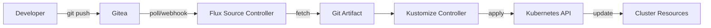
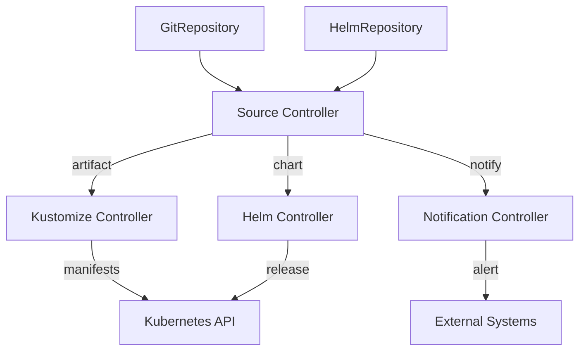
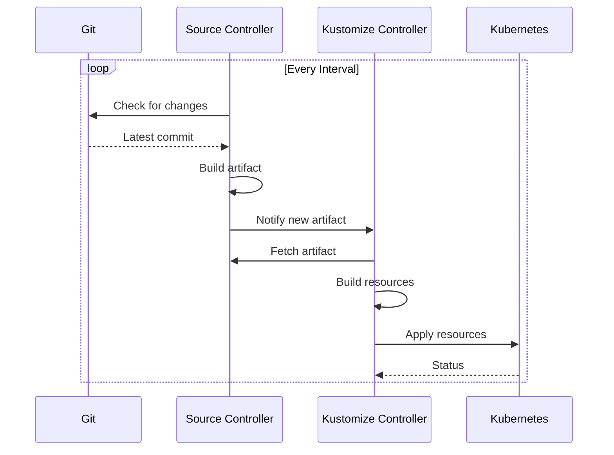

# GitOps Workflow with Flux CD

Complete guide to GitOps workflows using Flux CD and Gitea.

## Table of Contents

- [Overview](#overview)
- [Architecture](#architecture)
- [Repository Structure](#repository-structure)
- [Deployment Workflow](#deployment-workflow)
- [Common Workflows](#common-workflows)
- [Best Practices](#best-practices)
- [Advanced Patterns](#advanced-patterns)

## Overview

Flux CD implements GitOps by continuously reconciling the desired state (in Git) with the actual state (in Kubernetes). Changes to Git automatically trigger updates in the cluster.

### GitOps Principles

1. **Declarative**: All system state described declaratively in Git
2. **Versioned**: Complete history of all changes
3. **Automated**: Changes automatically applied to cluster
4. **Auditable**: Full audit trail via Git history
5. **Rollback-ready**: Revert to any previous state

### Flux Components

- **source-controller**: Fetches artifacts from Git/Helm/OCI
- **kustomize-controller**: Applies Kustomizations
- **helm-controller**: Manages Helm releases
- **notification-controller**: Handles alerts and webhooks
- **image-reflector-controller**: Scans container registries
- **image-automation-controller**: Updates image tags in Git

## Architecture

### High-Level Flow



### Component Interaction



### Reconciliation Loop



## Repository Structure

### Recommended Layout

```
infrastructure/
├── clusters/
│   └── dgx-spark/
│       ├── flux-system/              # Flux bootstrap
│       │   ├── gotk-components.yaml
│       │   ├── gotk-sync.yaml
│       │   └── kustomization.yaml
│       └── infrastructure.yaml       # Root Kustomization
├── infra/
│   ├── manifests/                    # Application manifests
│   │   ├── redis/
│   │   │   ├── namespace.yaml
│   │   │   ├── helmrelease.yaml
│   │   │   └── kustomization.yaml
│   │   ├── gitea/
│   │   │   ├── namespace.yaml
│   │   │   ├── helmrelease.yaml
│   │   │   └── kustomization.yaml
│   │   └── keda/
│   │       ├── namespace.yaml
│   │       ├── helmrelease.yaml
│   │       ├── scaledobject.yaml
│   │       └── kustomization.yaml
│   └── base/                         # Base configurations
│       └── kustomization.yaml
└── apps/                             # Application deployments
    └── ci-agents/
        ├── namespace.yaml
        ├── deployment.yaml
        ├── service.yaml
        └── kustomization.yaml
```

### Multi-Environment Structure

```
infrastructure/
├── base/                             # Base resources
│   ├── namespace.yaml
│   ├── deployment.yaml
│   └── kustomization.yaml
├── overlays/
│   ├── dev/
│   │   ├── kustomization.yaml
│   │   └── patches/
│   ├── staging/
│   │   ├── kustomization.yaml
│   │   └── patches/
│   └── prod/
│       ├── kustomization.yaml
│       └── patches/
└── clusters/
    ├── dev-cluster/
    ├── staging-cluster/
    └── prod-cluster/
```

## Deployment Workflow

### 1. Make Changes Locally

```bash
# Clone repository
git clone http://localhost:30080/raibid/infrastructure.git
cd infrastructure

# Create feature branch
git checkout -b add-monitoring

# Make changes
mkdir -p infra/manifests/prometheus
cat > infra/manifests/prometheus/namespace.yaml <<EOF
apiVersion: v1
kind: Namespace
metadata:
  name: monitoring
EOF

# Commit changes
git add infra/manifests/prometheus/
git commit -m "Add Prometheus monitoring namespace"
```

### 2. Push to Git

```bash
# Push to Gitea
git push origin add-monitoring

# Create merge request (via Gitea UI or API)
curl -X POST http://localhost:30080/api/v1/repos/raibid/infrastructure/pulls \
  -u raibid-admin:$GITEA_PASSWORD \
  -H "Content-Type: application/json" \
  -d '{
    "title": "Add Prometheus monitoring",
    "head": "add-monitoring",
    "base": "main"
  }'
```

### 3. Review and Merge

```bash
# Review changes in Gitea UI
# Merge pull request

# Or merge via command line
git checkout main
git merge add-monitoring
git push origin main
```

### 4. Flux Detects and Applies

```bash
# Flux automatically:
# 1. Detects new commit (within sync interval)
# 2. Fetches updated repository
# 3. Builds new artifact
# 4. Applies changes to cluster

# Watch reconciliation
flux logs --follow

# Check GitRepository status
flux get sources git

# Check Kustomization status
flux get kustomizations

# View applied resources
kubectl get namespaces monitoring
```

### 5. Verify Deployment

```bash
# Check resource status
kubectl get all -n monitoring

# View events
kubectl get events -n monitoring --sort-by='.lastTimestamp'

# Check Flux reconciliation
kubectl describe kustomization raibid-ci-infrastructure -n flux-system
```

## Common Workflows

### Deploy New Application

```bash
# 1. Create manifests
mkdir -p apps/my-app
cat > apps/my-app/kustomization.yaml <<EOF
apiVersion: kustomize.config.k8s.io/v1beta1
kind: Kustomization
resources:
  - namespace.yaml
  - deployment.yaml
  - service.yaml
EOF

# 2. Commit and push
git add apps/my-app/
git commit -m "Add my-app deployment"
git push

# 3. Wait for Flux to apply
flux reconcile kustomization raibid-ci-infrastructure --with-source

# 4. Verify
kubectl get deployment -n my-app
```

### Update Container Image

```bash
# 1. Update image tag
sed -i 's/image: app:v1.0/image: app:v1.1/' apps/my-app/deployment.yaml

# 2. Commit and push
git add apps/my-app/deployment.yaml
git commit -m "Update my-app to v1.1"
git push

# 3. Monitor rollout
kubectl rollout status deployment/my-app -n my-app
```

### Add Helm Chart

```bash
# 1. Create HelmRepository
cat > infra/manifests/helm-repos/bitnami.yaml <<EOF
apiVersion: source.toolkit.fluxcd.io/v1beta2
kind: HelmRepository
metadata:
  name: bitnami
  namespace: flux-system
spec:
  interval: 24h
  url: https://charts.bitnami.com/bitnami
EOF

# 2. Create HelmRelease
cat > infra/manifests/postgresql/helmrelease.yaml <<EOF
apiVersion: helm.toolkit.fluxcd.io/v2beta1
kind: HelmRelease
metadata:
  name: postgresql
  namespace: databases
spec:
  interval: 5m
  chart:
    spec:
      chart: postgresql
      version: "12.x"
      sourceRef:
        kind: HelmRepository
        name: bitnami
        namespace: flux-system
  values:
    auth:
      username: admin
      database: mydb
EOF

# 3. Commit and push
git add infra/manifests/
git commit -m "Add PostgreSQL via Helm"
git push
```

### Rollback Changes

```bash
# Method 1: Git revert
git revert HEAD
git push

# Method 2: Restore previous version
git checkout <previous-commit> -- path/to/file
git commit -m "Rollback to previous version"
git push

# Method 3: Manual suspension and apply
flux suspend kustomization raibid-ci-infrastructure
kubectl apply -f backup/previous-state.yaml
flux resume kustomization raibid-ci-infrastructure
```

### Emergency Manual Fix

```bash
# 1. Suspend Flux reconciliation
flux suspend kustomization raibid-ci-infrastructure

# 2. Apply emergency fix manually
kubectl apply -f emergency-fix.yaml

# 3. Update Git to match
git add emergency-fix.yaml
git commit -m "Emergency fix for production issue"
git push

# 4. Resume Flux
flux resume kustomization raibid-ci-infrastructure
```

## Best Practices

### Commit Messages

```bash
# Good commit messages
git commit -m "feat: add Redis for job queue"
git commit -m "fix: increase memory limit for CI agents"
git commit -m "refactor: reorganize namespace structure"
git commit -m "docs: update deployment instructions"

# Follow conventional commits
# <type>(<scope>): <description>
# Types: feat, fix, refactor, docs, test, chore
```

### Branch Strategy

```bash
# Feature branches
git checkout -b feature/add-monitoring
# ... make changes ...
git push origin feature/add-monitoring

# Environment branches (alternative approach)
main          # Production
├── staging   # Staging environment
└── dev       # Development environment
```

### Testing Changes

```bash
# 1. Validate locally
kustomize build infra/manifests | kubectl apply --dry-run=client -f -

# 2. Use dedicated test cluster
flux bootstrap ... --cluster=test-cluster

# 3. Test in dev namespace first
kubectl apply -f manifest.yaml -n dev --dry-run=server

# 4. Use Flux notifications for testing feedback
```

### Secret Management

```bash
# Option 1: Sealed Secrets
kubeseal --format=yaml < secret.yaml > sealed-secret.yaml
git add sealed-secret.yaml

# Option 2: SOPS (recommended)
sops --encrypt secret.yaml > secret.enc.yaml
git add secret.enc.yaml

# Option 3: External Secrets Operator
# Fetch from external vault/AWS Secrets Manager
```

### Resource Organization

```yaml
# Group related resources
apps/
  my-app/
    namespace.yaml        # Namespace first
    configmap.yaml        # Config before app
    secret.yaml
    deployment.yaml       # Application
    service.yaml          # Networking
    ingress.yaml
    kustomization.yaml    # Kustomization last
```

## Advanced Patterns

### Progressive Delivery

```yaml
# Canary deployment with Flagger
apiVersion: flagger.app/v1beta1
kind: Canary
metadata:
  name: my-app
  namespace: apps
spec:
  targetRef:
    apiVersion: apps/v1
    kind: Deployment
    name: my-app
  progressDeadlineSeconds: 60
  service:
    port: 80
  analysis:
    interval: 1m
    threshold: 5
    maxWeight: 50
    stepWeight: 10
```

### Multi-Cluster

```yaml
# Cluster 1: Production
---
apiVersion: kustomize.toolkit.fluxcd.io/v1
kind: Kustomization
metadata:
  name: apps-prod
  namespace: flux-system
spec:
  path: ./clusters/prod
  sourceRef:
    kind: GitRepository
    name: infrastructure

# Cluster 2: Staging
---
apiVersion: kustomize.toolkit.fluxcd.io/v1
kind: Kustomization
metadata:
  name: apps-staging
  namespace: flux-system
spec:
  path: ./clusters/staging
  sourceRef:
    kind: GitRepository
    name: infrastructure
```

### Dependency Management

```yaml
# Wait for namespace before deploying app
apiVersion: kustomize.toolkit.fluxcd.io/v1
kind: Kustomization
metadata:
  name: my-app
  namespace: flux-system
spec:
  dependsOn:
    - name: namespaces
  path: ./apps/my-app
  sourceRef:
    kind: GitRepository
    name: infrastructure
```

### Image Automation

```yaml
# Automatically update images
apiVersion: image.toolkit.fluxcd.io/v1beta1
kind: ImageRepository
metadata:
  name: my-app
  namespace: flux-system
spec:
  image: gitea.local/raibid/my-app
  interval: 1m

---
apiVersion: image.toolkit.fluxcd.io/v1beta1
kind: ImagePolicy
metadata:
  name: my-app
  namespace: flux-system
spec:
  imageRepositoryRef:
    name: my-app
  policy:
    semver:
      range: '>=1.0.0 <2.0.0'

---
apiVersion: image.toolkit.fluxcd.io/v1beta1
kind: ImageUpdateAutomation
metadata:
  name: my-app
  namespace: flux-system
spec:
  interval: 1m
  sourceRef:
    kind: GitRepository
    name: infrastructure
  git:
    commit:
      author:
        email: fluxbot@raibid.local
        name: Flux Bot
  update:
    path: ./apps/my-app
    strategy: Setters
```

### Health Checks

```yaml
# Monitor deployment health
apiVersion: kustomize.toolkit.fluxcd.io/v1
kind: Kustomization
metadata:
  name: my-app
  namespace: flux-system
spec:
  path: ./apps/my-app
  healthChecks:
    - apiVersion: apps/v1
      kind: Deployment
      name: my-app
      namespace: apps
    - apiVersion: v1
      kind: Service
      name: my-app
      namespace: apps
  timeout: 5m
```

## Quick Reference

### Flux Commands

```bash
# Check system health
flux check

# View all resources
flux get all

# Reconcile immediately
flux reconcile source git <name>
flux reconcile kustomization <name>

# Suspend/resume
flux suspend kustomization <name>
flux resume kustomization <name>

# Export configuration
flux export source git --all > sources.yaml
flux export kustomization --all > kustomizations.yaml

# View logs
flux logs --follow
flux logs --kind=Kustomization --name=<name>
```

### Git Commands

```bash
# Quick commit
git add .
git commit -m "Update infrastructure"
git push

# View history
git log --oneline --graph

# Compare branches
git diff main..feature-branch

# Revert commit
git revert <commit-hash>
git push
```

## References

- [Flux Documentation](https://fluxcd.io/docs/)
- [GitOps Principles](https://opengitops.dev/)
- [Kustomize Documentation](https://kustomize.io/)
- [Flux Best Practices](https://fluxcd.io/flux/guides/best-practices/)
